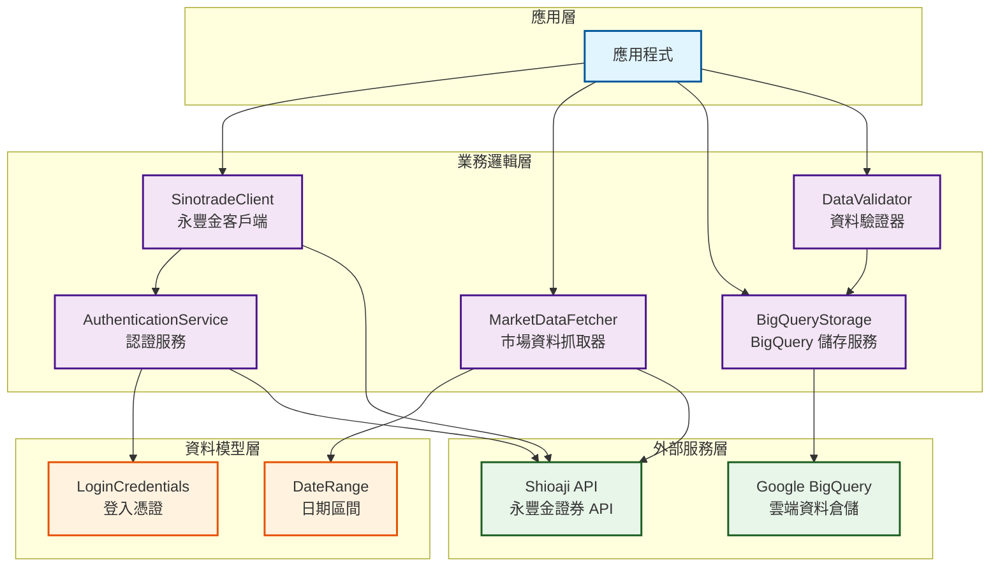
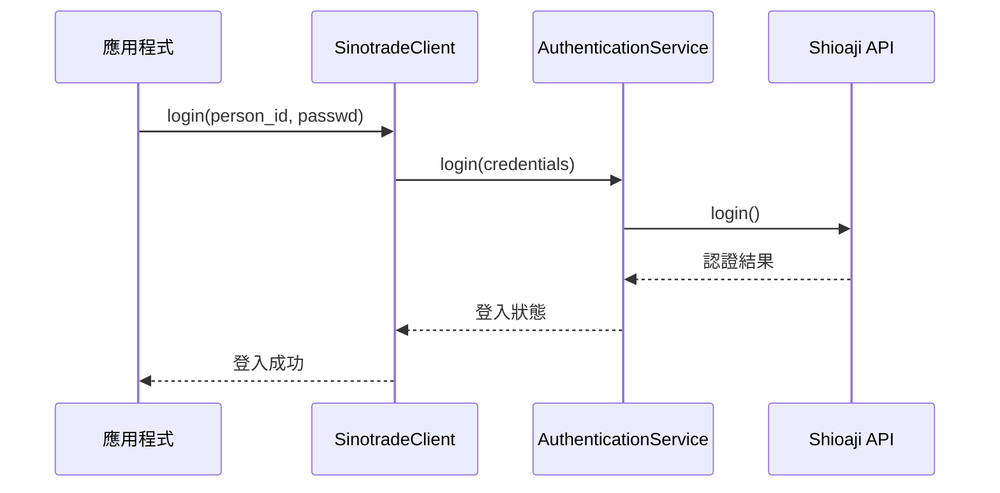
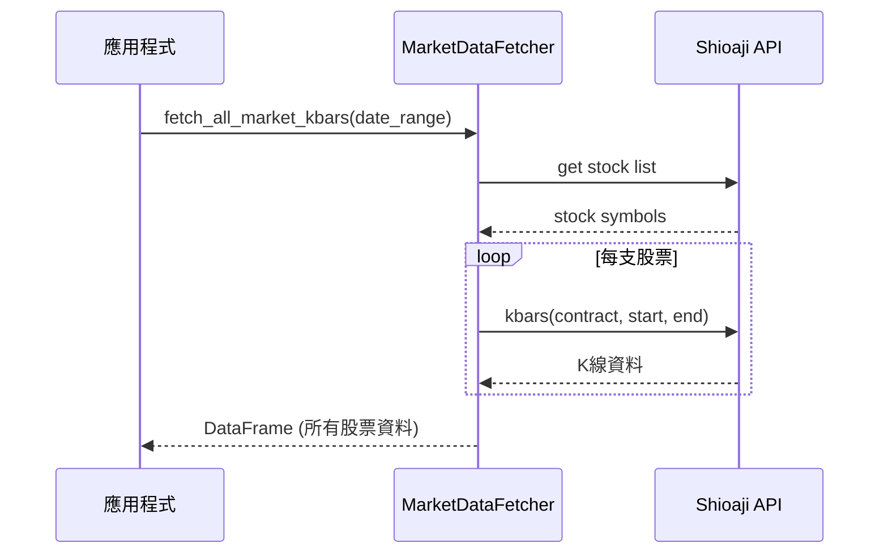
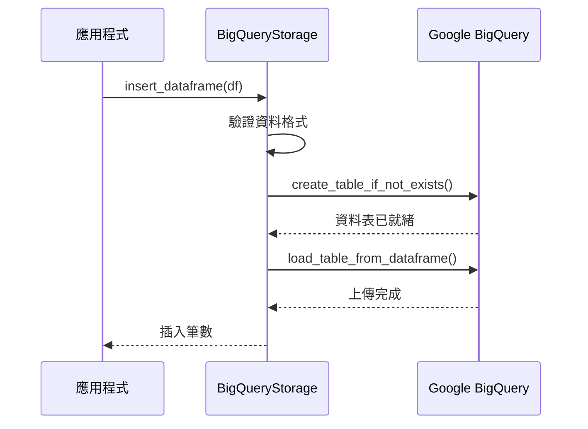
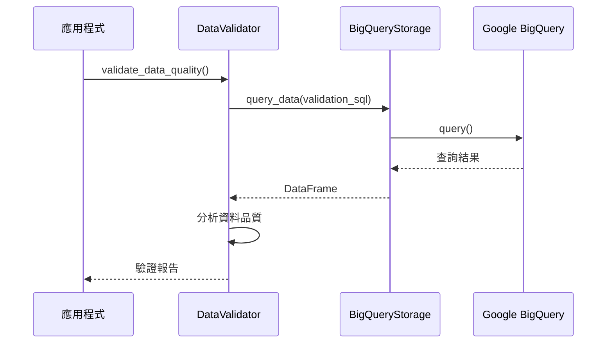
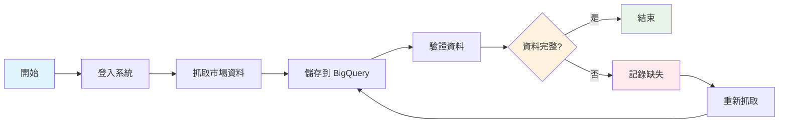
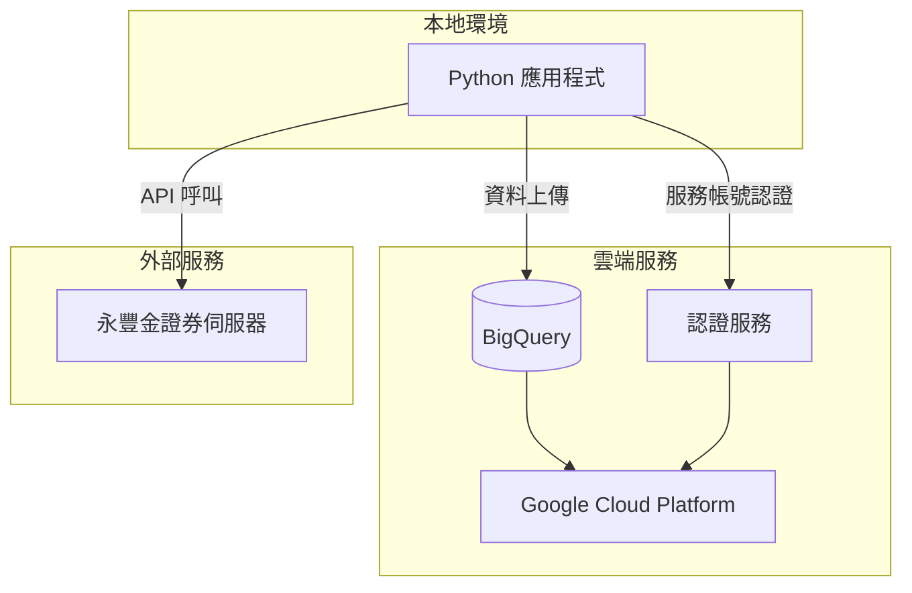

# 永豐金證券股票回測系統 - 元件圖

## 系統元件架構

## 元件職責說明

### 應用層

#### 應用程式（Application）
**職責**：系統的主要入口點
- 協調各個業務邏輯元件
- 處理使用者輸入和輸出
- 控制整體工作流程

### 業務邏輯層

#### SinotradeClient（永豐金客戶端）
**職責**：提供永豐金證券 API 的統一介面
- 管理 API 連線生命週期
- 提供帳號管理功能
- 整合認證服務
- 對外提供高層級的 API 操作

#### AuthenticationService（認證服務）
**職責**：處理使用者身份驗證
- 執行登入和登出操作
- 管理登入狀態
- 驗證使用者憑證

#### MarketDataFetcher（市場資料抓取器）
**職責**：從永豐金證券抓取市場資料
- 取得股票列表
- 抓取歷史 K 線資料
- 批量處理多支股票
- 資料格式轉換

#### BigQueryStorage（BigQuery 儲存服務）
**職責**：管理 BigQuery 資料存取
- 建立和維護資料表
- 上傳資料到 BigQuery
- 執行資料查詢
- 管理資料表分區和叢集

#### DataValidator（資料驗證器）
**職責**：驗證資料完整性和品質
- 檢查資料是否存在
- 驗證資料完整性
- 檢查資料品質
- 提供資料摘要統計

### 資料模型層

#### LoginCredentials（登入憑證）
**職責**：封裝登入資訊
- 儲存身份證字號和密碼
- 驗證憑證格式

#### DateRange（日期區間）
**職責**：封裝日期範圍
- 儲存開始和結束日期
- 驗證日期邏輯

### 外部服務層

#### Shioaji API（永豐金證券 API）
**職責**：提供證券交易功能
- 使用者認證
- 帳號管理
- 取得市場資料
- 執行交易操作

#### Google BigQuery（雲端資料倉儲）
**職責**：提供大數據儲存和查詢
- 儲存海量交易資料
- 支援快速查詢
- 提供資料分析功能

## 資料流程

### 1. 使用者認證流程

### 2. 資料抓取流程

### 3. 資料儲存流程

### 4. 資料驗證流程

## 完整工作流程

## 系統特性

### 模組化設計
- 每個元件都有明確的職責
- 元件之間低耦合、高內聚
- 易於測試和維護

### 可擴展性
- 可以輕鬆添加新的資料來源
- 支援不同的儲存後端
- 驗證規則可以靈活配置

### 可靠性
- 完整的錯誤處理機制
- 資料驗證確保品質
- 日誌記錄便於追蹤問題

### 效能考量
- BigQuery 資料表使用分區和叢集優化查詢
- 批量處理減少 API 呼叫次數
- 非同步處理提升效率（未來可擴展）

## 部署架構

## 安全性考量

### 認證管理
- 使用環境變數儲存敏感資訊
- 支援 GCP 服務帳號認證
- 不在程式碼中硬編碼密碼

### 資料安全
- BigQuery 資料加密
- 使用 IAM 控制存取權限
- 網路傳輸使用 HTTPS

### 錯誤處理
- 捕捉具體的錯誤類型
- 記錄詳細的錯誤資訊
- 不洩漏敏感資訊到日誌
