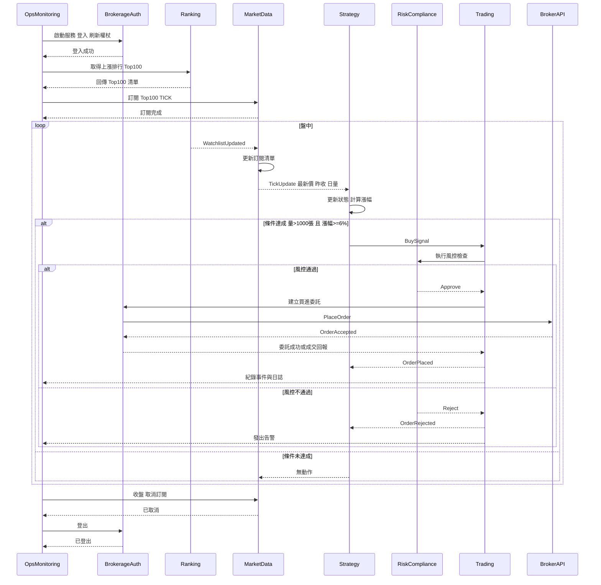

```mermaid
sequenceDiagram
    participant OpsMonitoring as OpsMonitoring
    participant Auth as BrokerageAuth
    participant Ranking as Ranking
    participant MarketData as MarketData
    participant Strategy as Strategy
    participant Risk as RiskCompliance
    participant Trading as Trading
    participant Broker as BrokerAPI

    OpsMonitoring->>Auth: 啟動服務 登入 刷新權杖
    Auth-->>OpsMonitoring: 登入成功

    OpsMonitoring->>Ranking: 取得上漲排行 Top100
    Ranking-->>OpsMonitoring: 回傳 Top100 清單
    OpsMonitoring->>MarketData: 訂閱 Top100 TICK
    MarketData-->>OpsMonitoring: 訂閱完成

    loop 盤中
        Ranking-->>MarketData: WatchlistUpdated
        MarketData->>MarketData: 更新訂閱清單

        MarketData-->>Strategy: TickUpdate 最新價 昨收 日量
        Strategy->>Strategy: 更新狀態 計算漲幅

        alt 條件達成 量>1000張 且 漲幅>=6%
            Strategy->>Trading: BuySignal
            Trading->>Risk: 執行風控檢查
            alt 風控通過
                Risk-->>Trading: Approve
                Trading->>Auth: 建立買進委託
                Auth->>Broker: PlaceOrder
                Broker-->>Auth: OrderAccepted
                Auth-->>Trading: 委託成功或成交回報
                Trading-->>Strategy: OrderPlaced
                Trading-->>OpsMonitoring: 紀錄事件與日誌
            else 風控不通過
                Risk-->>Trading: Reject
                Trading-->>Strategy: OrderRejected
                Trading-->>OpsMonitoring: 發出告警
            end
        else 條件未達成
            Strategy-->>MarketData: 無動作
        end
    end

    OpsMonitoring->>MarketData: 收盤 取消訂閱
    MarketData-->>OpsMonitoring: 已取消
    OpsMonitoring->>Auth: 登出
    Auth-->>OpsMonitoring: 已登出
```