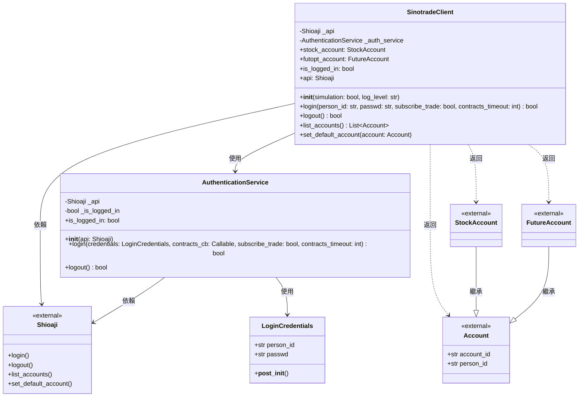

# 永豐金證券股票回測系統 - 類別圖

## 系統類別結構

## 類別職責說明

### LoginCredentials（登入憑證）
**職責**：封裝使用者登入所需的憑證資訊
- 儲存身份證字號和密碼
- 驗證憑證資料的有效性
- 確保資料完整性

### AuthenticationService（認證服務）
**職責**：專門處理帳號認證相關的操作
- 管理使用者登入狀態
- 執行登入和登出操作
- 驗證登入憑證
- 追蹤登入狀態

### SinotradeClient（永豐金證券客戶端）
**職責**：提供永豐金證券 API 的主要操作介面
- 管理 API 連線
- 提供高層級的 API 操作介面
- 整合認證服務
- 管理帳號資訊（證券帳號、期貨帳號）
- 提供合約查詢功能

### Shioaji（外部 API）
**職責**：永豐金證券官方提供的 Python API
- 提供底層的交易功能
- 處理與永豐金證券伺服器的通訊

### Account / StockAccount / FutureAccount（帳號類別）
**職責**：代表不同類型的交易帳號
- Account：基礎帳號類別
- StockAccount：證券交易帳號
- FutureAccount：期貨交易帳號

## 設計原則

### 單一職責原則（SRP）
- `LoginCredentials`：只負責封裝和驗證登入憑證
- `AuthenticationService`：只負責認證相關功能
- `SinotradeClient`：只負責提供客戶端操作介面

### 依賴反轉原則（DIP）
- `SinotradeClient` 依賴 `AuthenticationService` 抽象，而非具體實作
- 使用組合而非繼承，降低耦合度

### 開放封閉原則（OCP）
- 各類別設計允許擴展但不需修改現有程式碼
- 使用屬性裝飾器提供靈活的存取介面
