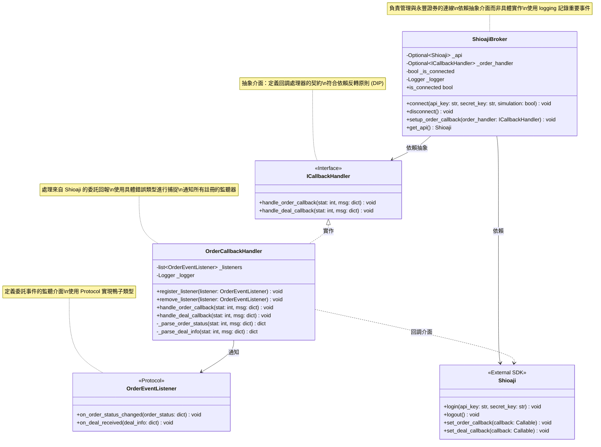

# 量化交易系統 - 類別圖

## 券商整合模組

本系統整合永豐證券 Shioaji SDK，提供委託回報處理功能。

## 設計說明

### SOLID 原則實踐

#### 1. 單一職責原則 (SRP) ✓
- **ICallbackHandler**: 定義回調處理的抽象介面
- **ShioajiBroker**: 專注於與券商的連線管理
  - 連線/斷線
  - API 實例管理
  - 設定回調處理器
- **OrderCallbackHandler**: 專注於委託回報的處理
  - 接收 Shioaji 的回調
  - 解析和標準化資料
  - 通知監聽器
- **OrderEventListener**: 定義監聽器介面
  - 使用 Protocol 提供靈活的介面定義

#### 2. 開放封閉原則 (OCP) ✓
- 使用 ICallbackHandler 介面，可擴展不同的回調處理器實作
- 使用 Protocol 定義 OrderEventListener，可添加新的監聽器
- 無需修改現有代碼即可擴展功能

#### 3. 里氏替換原則 (LSP) ✓
- 使用 Protocol 和抽象類別而非繼承
- 任何實作 ICallbackHandler 的類別都可替換使用

#### 4. 介面隔離原則 (ISP) ✓
- ICallbackHandler 只定義必要的兩個回調方法
- OrderEventListener 只定義必要的兩個事件處理方法
- 介面精簡，不強迫客戶端依賴不需要的方法

#### 5. 依賴反轉原則 (DIP) ✓
- ShioajiBroker 依賴 ICallbackHandler 抽象介面，而非具體的 OrderCallbackHandler
- OrderCallbackHandler 依賴 OrderEventListener Protocol，而非具體的監聽器實作
- 高層模組不依賴低層模組，都依賴抽象

### 錯誤處理規範

- 使用具體的錯誤類型 (AttributeError, TypeError, ValueError, ConnectionError, TimeoutError, KeyError)
- 避免使用籠統的 `except Exception`
- 使用 logging 模組記錄錯誤，而非 print

### 擴展性

- 使用觀察者模式，支援多個監聽器
- 透過 Protocol 和抽象類別，降低耦合度
- 易於添加新的事件類型或處理邏輯
- 支援依賴注入 (Logger)

## 設計模式

### 1. 觀察者模式 (Observer Pattern)

`OrderCallbackHandler` 作為主體，管理多個 `OrderEventListener` 監聽器，當收到委託回報時通知所有註冊的監聽器。

**優點**:
- 解耦事件發送者和接收者
- 支援動態添加/移除監聽器
- 一對多的依賴關係

### 2. 依賴注入模式 (Dependency Injection)

`ShioajiBroker` 和 `OrderCallbackHandler` 都支援 Logger 的依賴注入，提高測試性和靈活性。

**優點**:
- 易於測試（可注入 mock logger）
- 易於配置不同的日誌行為
- 降低類別間的耦合

### 3. 門面模式 (Facade Pattern)

`ShioajiBroker` 提供簡單的介面來操作複雜的 Shioaji SDK。

**優點**:
- 簡化外部使用
- 封裝複雜性
- 提供統一的介面
