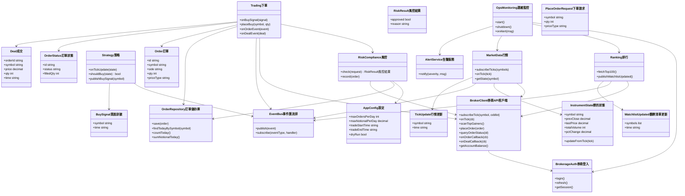

```mermaid
classDiagram
    class OpsMonitoring運維監控 {
      +start()
      +shutdown()
      +onAlert(msg)
    }
    class BrokerageAuth券商登入 {
      +login()
      +refresh()
      +getSession()
    }
    class Ranking排行 {
      +fetchTop100()
      +publishWatchlistUpdated()
    }
    class MarketData行情 {
      +subscribeTicks(symbols)
      +onTick(tick)
      +getState(symbol)
    }
    class InstrumentState標的狀態 {
      +symbol string
      +prevClose decimal
      +lastPrice decimal
      +totalVolume int
      +pctChange decimal
      +updateFromTick(tick)
    }
    class Strategy策略 {
      +onTickUpdate(state)
      +shouldBuy(state) bool
      +publishBuySignal(symbol)
    }
    class RiskCompliance風控 {
      +check(request) RiskResult風控結果
      +record(order)
    }
    class RiskResult風控結果 {
      +approved bool
      +reason string
    }
    class Trading下單 {
      +onBuySignal(signal)
      +placeBuy(symbol, qty)
      +onOrderEvent(event)
      +onDealEvent(deal)
    }
    class BrokerClient券商API客戶端 {
      +subscribeTick(symbol, oddlot)
      +onTick(cb)
      +scanTopGainers()
      +placeOrder(order)
      +queryOrderStatus(id)
      +onOrderCallback(cb)
      +onDealCallback(cb)
      +getAccountBalance()
    }
    class EventBus事件匯流排 {
      +publish(event)
      +subscribe(eventType, handler)
    }
    class AlertService告警服務 {
      +notify(severity, msg)
    }
    class AppConfig設定 {
      +maxOrdersPerDay int
      +maxNotionalPerDay decimal
      +tradeStartTime string
      +tradeEndTime string
      +dryRun bool
    }
    class Order訂單 {
      +id string
      +symbol string
      +side string
      +qty int
      +priceType string
    }
    class OrderStatus訂單狀態 {
      +id string
      +status string
      +filledQty int
    }
    class Deal成交 {
      +orderId string
      +symbol string
      +price decimal
      +qty int
      +time string
    }
    class BuySignal買進訊號 {
      +symbol string
      +time string
    }
    class WatchlistUpdated觀察清單更新 {
      +symbols list
      +time string
    }
    class TickUpdate行情更新 {
      +symbol string
      +time string
    }
    class PlaceOrderRequest下單請求 {
      +symbol string
      +qty int
      +priceType string
    }
    class OrderRepository訂單儲存庫 {
      +save(order)
      +findTodayBySymbol(symbol)
      +countToday()
      +sumNotionalToday()
    }

    OpsMonitoring運維監控 --> BrokerageAuth券商登入
    OpsMonitoring運維監控 --> Ranking排行
    OpsMonitoring運維監控 --> MarketData行情
    OpsMonitoring運維監控 --> AlertService告警服務

    Ranking排行 --> BrokerClient券商API客戶端
    Ranking排行 --> EventBus事件匯流排
    Ranking排行 --> WatchlistUpdated觀察清單更新

    MarketData行情 --> BrokerClient券商API客戶端
    MarketData行情 --> InstrumentState標的狀態
    MarketData行情 --> EventBus事件匯流排
    MarketData行情 --> TickUpdate行情更新

    Strategy策略 --> EventBus事件匯流排
    Strategy策略 --> BuySignal買進訊號

    Trading下單 --> RiskCompliance風控
    Trading下單 --> BrokerClient券商API客戶端
    Trading下單 --> EventBus事件匯流排
    Trading下單 --> OrderRepository訂單儲存庫
    Trading下單 --> Order訂單
    Trading下單 --> OrderStatus訂單狀態
    Trading下單 --> Deal成交

    RiskCompliance風控 --> AppConfig設定
    RiskCompliance風控 --> OrderRepository訂單儲存庫
    RiskCompliance風控 --> BrokerClient券商API客戶端

    BrokerClient券商API客戶端 --> BrokerageAuth券商登入
```