# 量化交易系統類別圖

## 系統架構概述

本系統為量化交易系統，包含身份驗證、市場數據訂閱、訂單執行、帳戶管理、策略執行等核心功能模組。

## 類別圖

```mermaid
classDiagram
    class Authentication {
        <<職責：處理使用者登入驗證與身份認證>>
        -api: Shioaji
        +__init__()
        +login(person_id, passwd, contracts_cb) bool
        +logout() bool
        +is_logged_in() bool
    }
    
    class InstrumentRetrieval {
        <<職責：取得可交易的金融商品資訊>>
        -api: Shioaji
        -contracts: Dict
        +__init__(api)
        +fetch_all_contracts() Dict
        +get_stock_contract(symbol) Contract
        +get_futures_contract(symbol, contract_date) Contract
        +search_contracts(keyword) List
        +get_contract_count() Dict
    }
    
    class QuoteSubscription {
        <<職責：訂閱即時市場報價資訊>>
        -api: Shioaji
        -subscribed_contracts: Set
        -quote_callback: QuoteCallback
        +__init__(api, quote_callback)
        +subscribe(contract) bool
        +subscribe_multiple(contracts) dict
        +unsubscribe(contract) bool
        +unsubscribe_all() bool
        +is_subscribed(contract) bool
        +get_subscribed_count() int
        +get_subscribed_contracts() List
    }
    
    class QuoteCallback {
        <<職責：接收並處理報價更新事件>>
        -callbacks: List
        -quote_history: List
        +__init__()
        +register_callback(callback) void
        +unregister_callback(callback) bool
        +on_quote_update(exchange, tick) void
        +get_latest_quote(code) Dict
        +get_quote_history(code, limit) List
        +clear_history() void
        +get_callback_count() int
    }
    
    class OrderExecution {
        <<職責：執行交易下單操作>>
        -api: Shioaji
        -order_history: List
        +__init__(api)
        +place_stock_order(contract, action, price, quantity, order_type, price_type) Trade
        +place_odd_lot_order(contract, action, price, quantity, order_type, price_type) Trade
        +place_market_order(contract, action, quantity, order_type) Trade
        +cancel_order(trade) bool
        +update_order(trade, price, quantity) Trade
        +get_order_history() List
        +get_order_by_id(order_id) Dict
        +clear_history() void
        +get_order_count() int
    }
    
    class FillReport {
        <<職責：取得並處理訂單成交資訊>>
        -api: Shioaji
        -fills: List
        -callbacks: List
        +__init__(api)
        +register_callback(callback) void
        +unregister_callback(callback) bool
        +get_fills() List
        +get_fills_by_contract(contract_code) List
        +get_fills_by_order_id(order_id) List
        +get_total_filled_quantity(contract_code) int
        +get_average_fill_price(contract_code) float
        +get_fill_summary() Dict
        +clear_fills() void
        +get_callback_count() int
    }
    
    class OrderReport {
        <<職責：取得並處理委託單狀態資訊>>
        -api: Shioaji
        -orders: List
        -callbacks: List
        +__init__(api)
        +register_callback(callback) void
        +unregister_callback(callback) bool
        +get_orders() List
        +get_orders_by_contract(contract_code) List
        +get_order_by_id(order_id) Dict
        +get_orders_by_status(status) List
        +get_pending_orders() List
        +get_order_summary() Dict
        +clear_orders() void
        +get_callback_count() int
    }
    
    class AccountInfo {
        <<職責：查詢帳戶餘額與損益資訊>>
        -api: Shioaji
        +get_account_balance() dict
        +get_realized_pnl() float
        +get_unrealized_pnl() float
    }
    
    class TradingStrategy {
        <<職責：實作交易策略邏輯與決策>>
        -name: str
        -parameters: dict
        +execute() void
        +generate_signals() list
    }
    
    class StrategyDataPreparation {
        <<職責：準備與處理策略所需的數據>>
        -raw_data: DataFrame
        +prepare_data(quotes) DataFrame
        +calculate_indicators() DataFrame
    }
    
    class TradingSummary {
        <<職責：彙整與呈現當前交易狀況>>
        -positions: list
        -pnl: float
        +get_summary() dict
        +display_report() void
    }
    
    %% 關聯關係
    Authentication --> InstrumentRetrieval : 提供 API 實例
    Authentication --> QuoteSubscription : 提供 API 實例
    Authentication --> OrderExecution : 提供 API 實例
    Authentication --> AccountInfo : 提供 API 實例
    InstrumentRetrieval --> QuoteSubscription : 提供商品合約
    QuoteSubscription --> QuoteCallback : 觸發報價事件
    QuoteCallback --> StrategyDataPreparation : 傳遞報價數據
    StrategyDataPreparation --> TradingStrategy : 提供處理後的數據
    TradingStrategy --> OrderExecution : 發送交易指令
    OrderExecution --> OrderReport : 產生委託記錄
    OrderExecution --> FillReport : 產生成交記錄
    FillReport --> AccountInfo : 更新帳戶狀態
    OrderReport --> TradingSummary : 提供委託狀態
    FillReport --> TradingSummary : 提供成交資訊
    AccountInfo --> TradingSummary : 提供帳戶損益
    TradingStrategy --> TradingSummary : 提供策略狀態
```

## 類別職責說明

| 類別名稱 | 職責描述 | 主要屬性 | 主要方法 |
|---------|---------|---------|---------|
| Authentication | 處理使用者登入驗證與身份認證，管理使用者會話與授權 | api (Shioaji 實例) | login(), logout(), is_logged_in() |
| InstrumentRetrieval | 取得可交易的金融商品資訊，提供商品代碼、規格等基本資料 | api, contracts | fetch_all_contracts(), get_stock_contract(), get_futures_contract(), search_contracts(), get_contract_count() |
| QuoteSubscription | 訂閱即時市場報價資訊，管理報價訂閱的啟動與停止 | api, subscribed_contracts, quote_callback | subscribe(), subscribe_multiple(), unsubscribe(), unsubscribe_all(), is_subscribed(), get_subscribed_count(), get_subscribed_contracts() |
| QuoteCallback | 接收並處理報價更新事件，將即時報價資料傳遞至相關模組 | callbacks, quote_history | register_callback(), unregister_callback(), on_quote_update(), get_latest_quote(), get_quote_history(), clear_history(), get_callback_count() |
| OrderExecution | 執行交易下單操作，處理買賣單的送出與取消 | api, order_history | place_stock_order(), place_odd_lot_order(), place_market_order(), cancel_order(), update_order(), get_order_history(), get_order_by_id(), clear_history(), get_order_count() |
| FillReport | 取得並處理訂單成交資訊，記錄成交價格、數量與時間 | api, fills, callbacks | register_callback(), unregister_callback(), get_fills(), get_fills_by_contract(), get_fills_by_order_id(), get_total_filled_quantity(), get_average_fill_price(), get_fill_summary(), clear_fills(), get_callback_count() |
| OrderReport | 取得並處理委託單狀態資訊，追蹤委託單的各種狀態變化 | api, orders, callbacks | register_callback(), unregister_callback(), get_orders(), get_orders_by_contract(), get_order_by_id(), get_orders_by_status(), get_pending_orders(), get_order_summary(), clear_orders(), get_callback_count() |
| AccountInfo | 查詢帳戶餘額與損益資訊，計算已實現與未實現損益 | api | get_account_balance(), get_realized_pnl(), get_unrealized_pnl() |
| TradingStrategy | 實作交易策略邏輯與決策，根據市場數據產生交易信號 | name, parameters | execute(), generate_signals() |
| StrategyDataPreparation | 準備與處理策略所需的數據，進行數據清洗、轉換與特徵計算 | raw_data | prepare_data(), calculate_indicators() |
| TradingSummary | 彙整與呈現當前交易狀況，提供交易績效與風險指標摘要 | positions, pnl | get_summary(), display_report() |

## 設計說明

本類別圖遵循 SOLID 設計原則：

- **單一職責原則**：每個類別都有明確且單一的職責
- **開放封閉原則**：類別間透過明確的介面互動，便於未來擴展
- **依賴反轉原則**：高層模組（如 TradingStrategy）依賴抽象的數據準備介面，而非具體實作

系統設計避免過度設計，每個類別的職責劃分清晰，符合實際業務需求。
