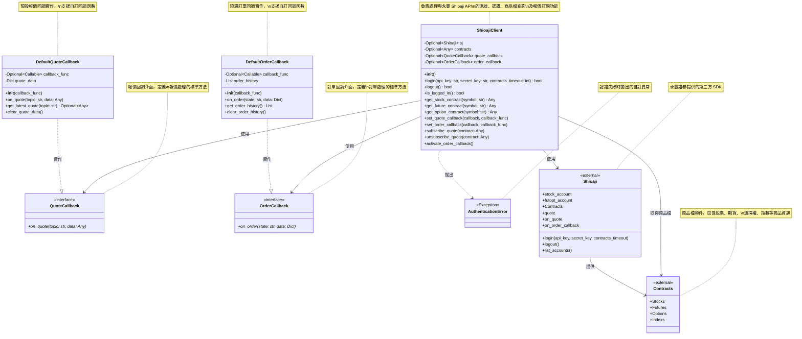

# 量化交易系統類別圖

## 系統類別關係圖

## 類別說明

### ShioajiClient
- **職責**: 封裝 Shioaji API 的登入、登出、商品檔查詢及報價訂閱功能
- **屬性**:
  - `sj`: 儲存 Shioaji API 實例，登入成功後可供其他功能使用
  - `contracts`: 儲存商品檔物件，登入成功後自動載入
  - `quote_callback`: 報價回調處理器
  - `order_callback`: 訂單回調處理器
- **方法**:
  - `login()`: 使用 API Key 進行登入認證，並自動載入商品檔
  - `logout()`: 登出並清理連線與商品檔
  - `is_logged_in()`: 檢查當前登入狀態
  - `get_stock_contract()`: 取得指定股票商品檔（支援 TSE/OTC）
  - `get_future_contract()`: 取得指定期貨商品檔
  - `get_option_contract()`: 取得指定選擇權商品檔
  - `set_quote_callback()`: 設定報價回調處理器
  - `set_order_callback()`: 設定訂單回調處理器
  - `subscribe_quote()`: 訂閱商品報價
  - `unsubscribe_quote()`: 取消訂閱商品報價
  - `activate_order_callback()`: 啟用訂單回調監控

### QuoteCallback（抽象介面）
- **職責**: 定義報價回調處理的標準介面
- **設計模式**: 策略模式（Strategy Pattern）
- **方法**:
  - `on_quote()`: 處理報價資料的抽象方法

### OrderCallback（抽象介面）
- **職責**: 定義訂單回調處理的標準介面
- **設計模式**: 策略模式（Strategy Pattern）
- **方法**:
  - `on_order()`: 處理訂單狀態更新的抽象方法

### DefaultQuoteCallback
- **職責**: 提供預設的報價回調實作
- **繼承**: 實作 QuoteCallback 介面
- **屬性**:
  - `callback_func`: 使用者自訂的回調函數
  - `quote_data`: 儲存最新的報價資料
- **方法**:
  - `on_quote()`: 儲存報價並觸發自訂回調
  - `get_latest_quote()`: 取得指定商品的最新報價
  - `clear_quote_data()`: 清除所有報價資料

### DefaultOrderCallback
- **職責**: 提供預設的訂單回調實作
- **繼承**: 實作 OrderCallback 介面
- **屬性**:
  - `callback_func`: 使用者自訂的回調函數
  - `order_history`: 儲存訂單歷史記錄
- **方法**:
  - `on_order()`: 記錄訂單並觸發自訂回調
  - `get_order_history()`: 取得訂單歷史記錄
  - `clear_order_history()`: 清除訂單歷史記錄

### AuthenticationError
- **職責**: 提供明確的認證錯誤異常類型
- **繼承**: Python 內建的 Exception 類別
- **用途**: 與一般的連線錯誤或其他錯誤區分

### Shioaji（外部依賴）
- **來源**: 永豐證券提供的 Python SDK
- **職責**: 提供交易 API 的底層實作
- **版本要求**: >= 1.1.0
- **重要屬性**: 
  - `Contracts`: 商品檔物件
  - `quote`: 報價服務物件
  - `on_quote`: 報價回調裝飾器
  - `on_order_callback`: 訂單回調裝飾器

### Contracts（外部依賴）
- **來源**: Shioaji SDK 提供的商品檔物件
- **職責**: 儲存所有可交易的商品資訊
- **包含商品類型**:
  - `Stocks`: 股票（TSE 上市、OTC 上櫃）
  - `Futures`: 期貨
  - `Options`: 選擇權
  - `Indexs`: 指數（僅供行情訂閱，不可下單）
- **更新時間**:
  - 07:50 期貨商品檔更新
  - 08:00 全市場商品檔更新
  - 14:45 期貨夜盤商品檔更新
  - 17:15 期貨夜盤商品檔更新

## 設計模式

### 策略模式（Strategy Pattern）
本系統使用策略模式來實作報價和訂單的回調處理：

- **優點**:
  1. 允許使用者自訂回調處理邏輯
  2. 符合開放封閉原則（對擴展開放，對修改封閉）
  3. 使用抽象介面定義標準行為
  4. 提供預設實作，降低使用門檻

- **使用範例**:
  - 使用預設實作：透過 `set_quote_callback(callback_func=my_func)` 快速設定
  - 自訂實作：繼承 `QuoteCallback` 實作 `on_quote()` 方法，提供完全自訂的處理邏輯
