# 量化交易系統類別圖

## 系統架構概覽

本文件描述量化交易系統的類別架構，展示系統中各個類別的職責與關係。

## 類別圖

```mermaid
classDiagram
    class 啟動入口 {
        <<職責>>
        負責系統初始化與啟動主程式
    }
    
    class 主程式 {
        <<職責>>
        負責控制整個交易流程的協調與管理
    }
    
    class Login {
        <<登入>>
        -sj: Optional[Shioaji]
        +login(api_key: str, secret_key: str) Shioaji
        +is_logged_in() bool
        +logout() None
        --
        負責使用者驗證與身份認證
        保存 Shioaji API 物件供後續使用
    }
    
    class ContractManager {
        <<取得商品檔>>
        -_api: Shioaji
        -contracts: Optional[Any]
        +fetch_contracts(contract_download: bool, timeout: int) Any
        +get_stock(stock_code: str) Optional[Any]
        +get_future(future_code: str) Optional[Any]
        +get_all_stocks() Dict[str, Any]
        +is_contracts_ready() bool
        --
        負責獲取可交易的商品資訊
        包含證券、期貨、選擇權和指數
    }
    
    class QuoteSubscriber {
        <<訂閱報價>>
        -_api: Shioaji
        -_subscribed_contracts: List[Any]
        +subscribe(contract: Any, quote_type: str, version: str) bool
        +unsubscribe(contract: Any) bool
        +get_subscribed_contracts() List[Any]
        +is_subscribed(contract: Any) bool
        --
        負責訂閱即時市場報價
        支援股票、期貨等商品的即時報價訂閱
    }
    
    class QuoteCallback {
        <<報價回調處理>>
        -_api: Shioaji
        -_quote_callbacks: List[Callable]
        -_order_callbacks: List[Callable]
        -_latest_quotes: Dict[str, Any]
        +set_quote_callback(callback: Callable) None
        +set_order_callback(callback: Callable) None
        +get_latest_quote(code: str) Optional[Dict]
        +get_all_latest_quotes() Dict[str, Dict]
        +clear_callbacks() None
        --
        負責處理接收到的報價資料
        提供自訂回調函數的註冊與管理
    }
    
    class OrderExecutor {
        <<下單執行>>
        -_api: Shioaji
        -_last_trade: Optional[Any]
        +place_stock_order(contract: Any, action: str, price: float, quantity: int, order_type: str, price_type: str, order_lot: str, timeout: int) Any
        +update_order(trade: Any, price: float, quantity: int, timeout: int) Any
        +cancel_order(trade: Any, timeout: int) Any
        +get_last_trade() Optional[Any]
        --
        負責執行交易訂單
        支援股票整股、盤中零股的買賣下單
    }
    
    class TradeMonitor {
        <<交易監控>>
        -_api: Shioaji
        -_trades_cache: Dict[str, Any]
        -_last_update_time: Optional[datetime]
        +list_trades(account: Any) List[Any]
        +update_status(account: Any, timeout: int) None
        +get_trade_by_id(order_id: str) Optional[Any]
        +get_filled_trades() List[Any]
        +get_filling_trades() List[Any]
        +get_submitted_trades() List[Any]
        +get_deals(trade: Any) List[Any]
        +get_last_update_time() Optional[datetime]
        +clear_cache() None
        --
        負責獲取已成交訂單資訊與委託訂單狀態
        提供成交回報、委託回報的查詢與管理
    }
    
    class AccountManager {
        <<帳戶管理>>
        -_api: Shioaji
        -_positions_cache: List[Any]
        -_last_update_time: Optional[datetime]
        +list_positions(account: Any, unit: str, timeout: int) List[Any]
        +get_position_by_code(code: str) Optional[Any]
        +get_total_unrealized_pnl() float
        +get_positions_by_direction(direction: str) List[Any]
        +get_positions_with_profit() List[Any]
        +get_positions_with_loss() List[Any]
        +get_position_summary() Dict[str, Any]
        +get_last_update_time() Optional[datetime]
        +clear_cache() None
        --
        負責獲取帳戶餘額與損益資訊
        提供持倉、已實現與未實現損益的查詢
    }
    
    class StrategyDataPreparer {
        <<策略數據準備>>
        -_market_scanner: Any
        -_quote_callback: Any
        -_market_data: Dict[str, Any]
        -_update_interval: int
        -_timer: Optional[Timer]
        -_is_running: bool
        +set_update_interval(seconds: int) None
        +update_market_data(count: int) Dict[str, Any]
        +start_auto_update(count: int) None
        +stop_auto_update() None
        +get_market_data() Dict[str, Any]
        +get_top_gainers(top_n: int) List[Any]
        +get_top_volume(top_n: int) List[Any]
        +get_latest_quote(code: str) Optional[Dict]
        +is_auto_update_running() bool
        +get_last_update_time() Optional[datetime]
        --
        負責準備策略所需的市場數據
        定期獲取市場交易狀況排行
    }
    
    class TradingSignal {
        <<交易訊號>>
        +code: str
        +action: str
        +price: float
        +quantity: int
        +reason: str
        +timestamp: datetime
        --
        交易訊號資料類別
    }
    
    class MomentumStrategy {
        <<動能交易策略>>
        -_quote_callback: Any
        -_change_percent_threshold: float
        -_volume_threshold: int
        -_signals: List[TradingSignal]
        -_signal_callbacks: List[Callable]
        -_monitored_stocks: Dict[str, bool]
        +set_change_percent_threshold(threshold: float) None
        +set_volume_threshold(threshold: int) None
        +register_signal_callback(callback: Callable) None
        +get_signals() List[TradingSignal]
        +get_latest_signal() Optional[TradingSignal]
        +clear_signals() None
        +reset_monitored_stock(code: str) None
        +get_monitored_stocks() List[str]
        +get_thresholds() Dict[str, Any]
        --
        負責實現交易策略邏輯與決策
        監控報價並產生交易訊號
    }
    
    class MarketScanner {
        <<市場交易狀況排行>>
        -_api: Shioaji
        -_last_scan_result: Optional[List[Any]]
        -_last_scan_time: Optional[datetime]
        +get_change_percent_rank(count: int, ascending: bool, date: str, timeout: int) List[Any]
        +get_change_price_rank(count: int, ascending: bool, date: str, timeout: int) List[Any]
        +get_volume_rank(count: int, ascending: bool, date: str, timeout: int) List[Any]
        +get_amount_rank(count: int, ascending: bool, date: str, timeout: int) List[Any]
        +get_day_range_rank(count: int, ascending: bool, date: str, timeout: int) List[Any]
        +get_last_scan_result() Optional[List[Any]]
        +get_last_scan_time() Optional[datetime]
        --
        負責匯總和展示當前交易狀況
        提供漲跌幅、成交量、成交金額等排行查詢
    }
    
    %% 系統啟動與控制流程
    啟動入口 --> 主程式
    
    %% 主程式協調各個模組
    主程式 --> Login
    主程式 --> ContractManager
    主程式 --> QuoteSubscriber
    主程式 --> QuoteCallback
    主程式 --> StrategyDataPreparer
    主程式 --> MomentumStrategy
    主程式 --> OrderExecutor
    主程式 --> TradeMonitor
    主程式 --> AccountManager
    主程式 --> MarketScanner
    
    %% Login 與其他模組的依賴關係
    Login --> ContractManager : 提供 API 物件
    Login --> QuoteSubscriber : 提供 API 物件
    Login --> QuoteCallback : 提供 API 物件
    Login --> OrderExecutor : 提供 API 物件
    Login --> TradeMonitor : 提供 API 物件
    Login --> AccountManager : 提供 API 物件
    Login --> MarketScanner : 提供 API 物件
    
    %% 報價處理流程
    ContractManager --> QuoteSubscriber : 提供商品合約
    QuoteSubscriber --> QuoteCallback : 觸發回調
    QuoteCallback --> StrategyDataPreparer : 傳遞報價資料
    MarketScanner --> StrategyDataPreparer : 提供市場排行
    
    %% 策略執行流程
    QuoteCallback --> MomentumStrategy : 報價回調
    StrategyDataPreparer --> MomentumStrategy : 提供市場數據
    MomentumStrategy --> TradingSignal : 產生訊號
    MomentumStrategy --> OrderExecutor : 發出交易指令
    ContractManager --> OrderExecutor : 提供商品合約
    
    %% 訂單與帳戶管理
    OrderExecutor --> TradeMonitor : 產生交易記錄
    TradeMonitor --> AccountManager : 提供成交資訊
    QuoteCallback --> TradeMonitor : 委託回報通知
    MomentumStrategy --> AccountManager : 查詢帳戶資訊
    
    %% 交易狀況監控
    AccountManager --> MarketScanner : 提供帳戶資訊
    TradeMonitor --> MarketScanner : 提供委託資訊
    MomentumStrategy --> MarketScanner : 查詢市場排行
    MomentumStrategy --> TradeMonitor : 查詢交易狀態
```

## 類別職責說明

| 類別名稱 | 職責描述 | 實作狀態 |
|---------|---------|----------|
| 啟動入口 | 負責系統初始化與啟動主程式 | 待實作 |
| 主程式 | 負責控制整個交易流程的協調與管理 | 待實作 |
| Login | 負責使用者驗證與身份認證，保存 Shioaji API 物件供後續使用 | ✅ 已實作 |
| ContractManager | 負責獲取可交易的商品資訊，包含證券、期貨、選擇權和指數 | ✅ 已實作 |
| QuoteSubscriber | 負責訂閱即時市場報價，支援股票、期貨等商品的即時報價訂閱 | ✅ 已實作 |
| QuoteCallback | 負責處理接收到的報價資料，提供自訂回調函數的註冊與管理 | ✅ 已實作 |
| OrderExecutor | 負責執行交易訂單，支援股票整股、盤中零股的買賣下單 | ✅ 已實作 |
| TradeMonitor | 負責獲取已成交訂單資訊與委託訂單狀態，提供成交回報、委託回報的查詢與管理 | ✅ 已實作 |
| AccountManager | 負責獲取帳戶餘額與損益資訊，提供持倉、已實現與未實現損益的查詢 | ✅ 已實作 |
| StrategyDataPreparer | 負責準備策略所需的市場數據，定期獲取市場交易狀況排行 | ✅ 已實作 |
| TradingSignal | 交易訊號資料類別，包含股票代碼、動作、價格、數量等資訊 | ✅ 已實作 |
| MomentumStrategy | 負責實現動能交易策略邏輯與決策，監控報價並產生交易訊號 | ✅ 已實作 |
| MarketScanner | 負責匯總和展示當前交易狀況，提供漲跌幅、成交量、成交金額等排行查詢 | ✅ 已實作 |

## 系統流程說明

1. **系統啟動**：啟動入口初始化並啟動主程式
2. **身份驗證**：主程式呼叫登入模組進行身份認證
3. **數據獲取**：取得商品檔資訊並訂閱市場報價
4. **報價處理**：報價Callback接收數據並傳遞給策略數據準備模組
5. **策略執行**：策略模組根據準備好的數據做出交易決策
6. **訂單執行**：下單模組執行交易指令
7. **狀態監控**：取得委託回報與成交回報，更新帳戶資訊
8. **狀況摘要**：摘要模組整合所有資訊並展示當前交易狀況
