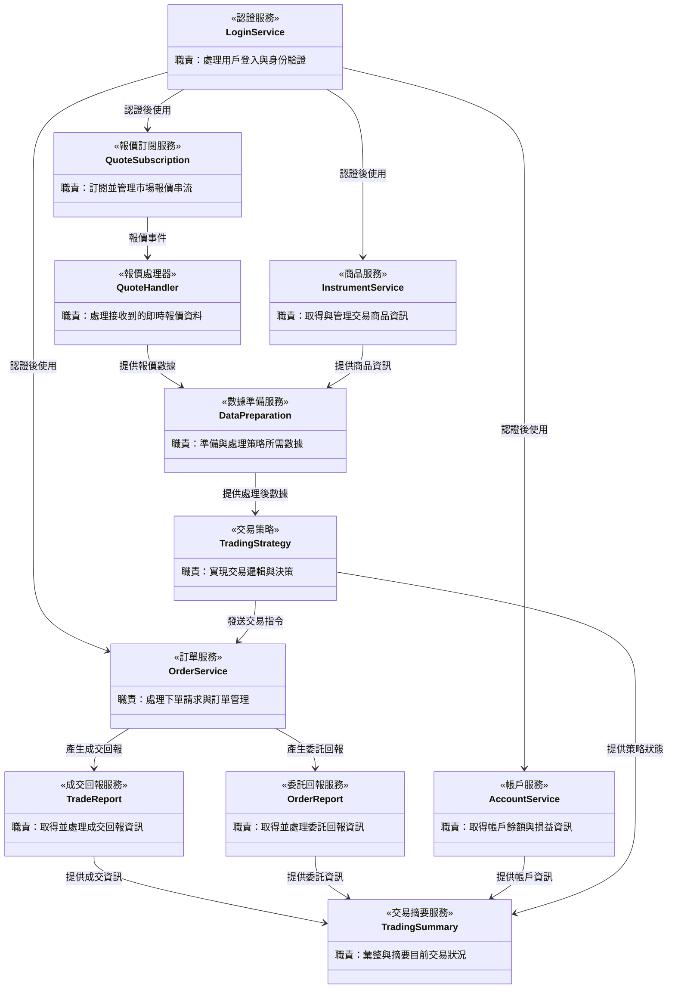

# 量化交易系統 - 類別圖

## 系統架構概覽

本系統採用模組化設計，將量化交易的各項功能分離為獨立的類別，以提高系統的可維護性和擴展性。

## 類別圖

## 類別職責說明

| 類別名稱 | 職責描述 |
|---------|---------|
| LoginService | 處理用戶登入與身份驗證，確保系統安全性 |
| InstrumentService | 取得與管理交易商品資訊，包括商品規格、合約細節等 |
| QuoteSubscription | 訂閱並管理市場報價串流，處理訂閱生命週期 |
| QuoteHandler | 處理接收到的即時報價資料，作為報價事件的回調處理器 |
| OrderService | 處理下單請求與訂單管理，包括委託、修改、取消等操作 |
| TradeReport | 取得並處理成交回報資訊，追蹤訂單執行狀況 |
| OrderReport | 取得並處理委託回報資訊，監控訂單狀態變化 |
| AccountService | 取得帳戶餘額、已實現損益與未實現損益等帳戶資訊 |
| TradingStrategy | 實現交易邏輯與決策，根據市場數據產生交易信號 |
| DataPreparation | 準備與處理策略所需數據，包括數據清洗、特徵工程等 |
| TradingSummary | 彙整與摘要目前交易狀況，提供系統整體運行概覽 |

## 設計說明

### 核心流程

1. **認證階段**：透過 `LoginService` 完成身份驗證
2. **數據階段**：使用 `InstrumentService` 取得商品資訊，透過 `QuoteSubscription` 訂閱報價
3. **處理階段**：`QuoteHandler` 接收報價，`DataPreparation` 準備策略數據
4. **策略階段**：`TradingStrategy` 根據數據做出交易決策
5. **執行階段**：`OrderService` 執行交易指令
6. **監控階段**：`TradeReport`、`OrderReport`、`AccountService` 追蹤執行結果
7. **彙總階段**：`TradingSummary` 提供整體交易狀況摘要

### 設計原則

- **單一職責**：每個類別專注於單一功能領域
- **鬆散耦合**：透過明確的介面降低類別間的依賴
- **高內聚性**：相關功能集中在同一類別中
- **可擴展性**：預留擴展空間，方便未來新增功能

## SOLID 原則檢視

### ✅ 單一職責原則 (S)
- 每個類別都有明確的單一職責
- 職責劃分清晰，符合此原則

### ⚠️ 開放封閉原則 (O)
**改進建議：**
- `TradingStrategy` 應設計為抽象基類，允許實作多種策略
- `QuoteHandler` 可以設計為介面，支援不同的處理邏輯

### ✅ 里氏替換原則 (L)
- 目前無繼承關係，實作時需注意此原則

### ⚠️ 介面隔離原則 (I)
**改進建議：**
- 為各服務定義精簡的介面
- `TradingSummary` 應透過最小化介面獲取所需資訊

### ❌ 依賴反轉原則 (D)
**主要問題：**
- 類別之間直接依賴具體實作
- 缺少抽象層（介面或抽象類別）

**改進方向：**
- 引入介面層，讓高層模組依賴抽象而非具體實作
- 例如：`TradingStrategy` 應依賴 `IOrderService` 介面，而非直接依賴 `OrderService`

### 總結
目前設計在單一職責方面表現良好，但在依賴管理和抽象化方面需要改進。建議在實作階段引入適當的介面和抽象類別，以符合完整的 SOLID 原則。

