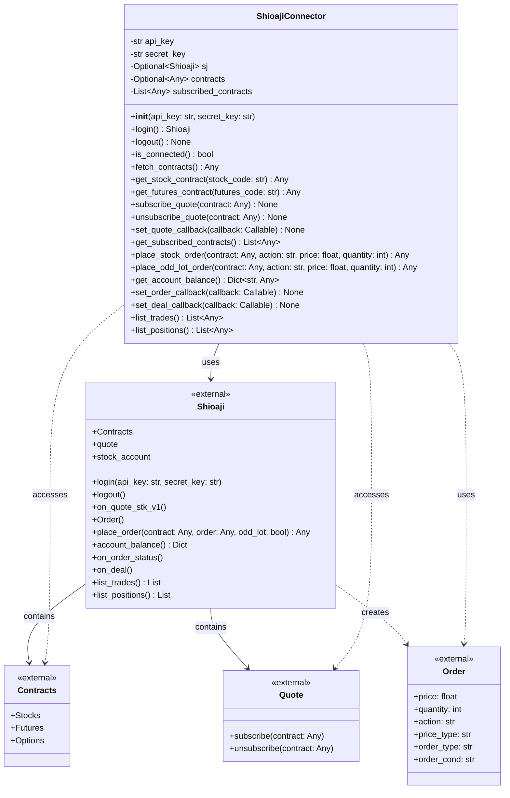

# 類別圖

本文件描述量化交易系統的類別結構。

## ShioajiConnector 類別圖

## 類別說明

### ShioajiConnector
負責管理與永豐證券 Shioaji API 的連線。

**屬性：**
- `api_key`: API 金鑰
- `secret_key`: 密鑰
- `sj`: Shioaji 連線實例（登入後才會有值）
- `contracts`: 商品檔合約資料（取得商品檔後才會有值）
- `subscribed_contracts`: 已訂閱的合約列表

**方法：**
- `__init__(api_key, secret_key)`: 初始化連線器，驗證金鑰不為空
- `login()`: 執行登入操作，返回 Shioaji 實例並保存在 sj 屬性中
- `logout()`: 登出並關閉連線
- `is_connected()`: 檢查是否已建立連線
- `fetch_contracts()`: 取得所有商品檔合約資料並保存在 contracts 屬性中
- `get_stock_contract(stock_code)`: 取得指定股票代碼的合約資料
- `get_futures_contract(futures_code)`: 取得指定期貨代碼的合約資料
- `subscribe_quote(contract)`: 訂閱指定合約的即時報價
- `unsubscribe_quote(contract)`: 取消訂閱指定合約的即時報價
- `set_quote_callback(callback)`: 設定報價資料的 callback 函數
- `get_subscribed_contracts()`: 取得已訂閱的合約列表
- `place_stock_order(contract, action, price, quantity)`: 下一般股票委託單（整股）
- `place_odd_lot_order(contract, action, price, quantity)`: 下盤中零股委託單
- `get_account_balance()`: 取得帳戶餘額資訊
- `set_order_callback(callback)`: 設定訂單狀態回報的 callback 函數
- `set_deal_callback(callback)`: 設定成交回報的 callback 函數
- `list_trades()`: 取得當日所有委託記錄
- `list_positions()`: 取得目前持倉資訊

**設計原則：**
- 遵循單一職責原則（SRP）：專注於處理 Shioaji API 互動，包括連線管理、商品檔存取、報價訂閱、下單與成交回報
- 遵循依賴反轉原則（DIP）：依賴於 Shioaji 的抽象介面，透過 callback 機制實現依賴反轉
- 提供完整的錯誤處理，針對不同錯誤類型進行具體處理
- 遵循開放封閉原則（OCP）：可透過新增方法擴展功能，不需修改現有程式碼
- 遵循介面隔離原則（ISP）：透過 callback 函數讓使用者自定義報價、訂單狀態、成交回報處理邏輯，不強制依賴不需要的功能
- 參數驗證：所有下單方法都有嚴格的參數驗證，確保下單資料的正確性
- 事件驅動設計：透過 callback 機制實現事件驅動，使用者可以灰活處理訂單狀態與成交回報

### Shioaji
永豐證券提供的外部 API 類別，包含登入、登出、Contracts 商品檔物件及 Quote 報價物件。

### Contracts
Shioaji 提供的商品檔物件，包含所有可交易的商品合約（股票、期貨、選擇權等）。

### Quote
Shioaji 提供的報價物件，負責處理即時報價訂閱與取消訂閱功能。

### Order
Shioaji 提供的訂單物件，用於定義委託單的內容，包括價格、數量、買賣方向等資訊。
