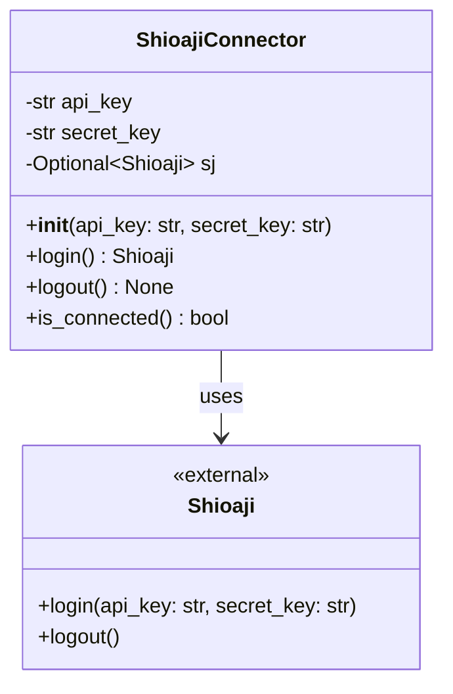

# 類別圖

本文件描述量化交易系統的類別結構。

## ShioajiConnector 類別圖

## 類別說明

### ShioajiConnector
負責管理與永豐證券 Shioaji API 的連線。

**屬性：**
- `api_key`: API 金鑰
- `secret_key`: 密鑰
- `sj`: Shioaji 連線實例（登入後才會有值）

**方法：**
- `__init__(api_key, secret_key)`: 初始化連線器，驗證金鑰不為空
- `login()`: 執行登入操作，返回 Shioaji 實例並保存在 sj 屬性中
- `logout()`: 登出並關閉連線
- `is_connected()`: 檢查是否已建立連線

**設計原則：**
- 遵循單一職責原則（SRP）：專注於處理 Shioaji 的連線管理
- 遵循依賴反轉原則（DIP）：依賴於 Shioaji 的抽象介面
- 提供完整的錯誤處理，針對不同錯誤類型進行具體處理

### Shioaji
永豐證券提供的外部 API 類別。
