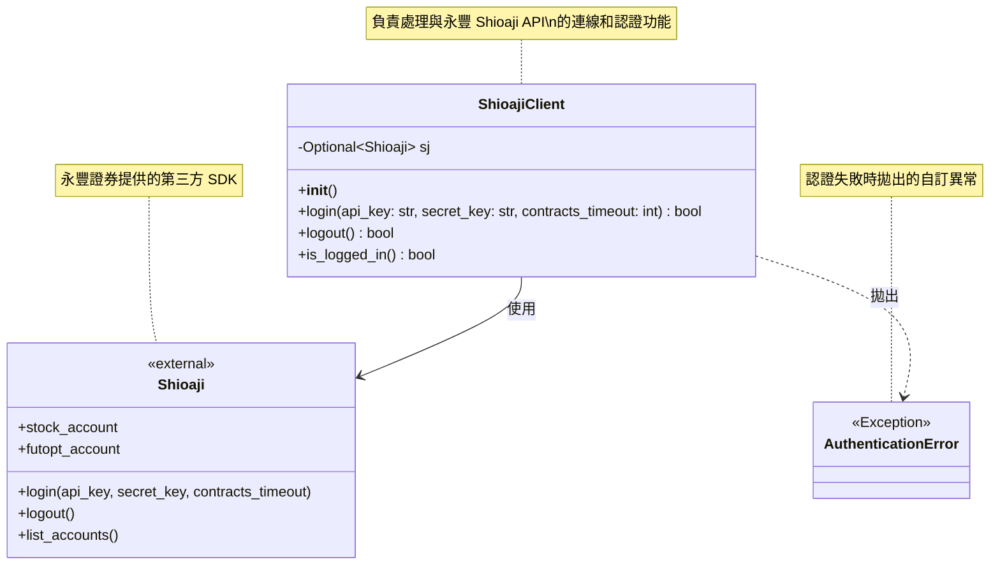

# 量化交易系統類別圖

## 系統類別關係圖

## 類別說明

### ShioajiClient
- **職責**: 封裝 Shioaji API 的登入、登出功能
- **屬性**:
  - `sj`: 儲存 Shioaji API 實例，登入成功後可供其他功能使用
- **方法**:
  - `login()`: 使用 API Key 進行登入認證
  - `logout()`: 登出並清理連線
  - `is_logged_in()`: 檢查當前登入狀態

### AuthenticationError
- **職責**: 提供明確的認證錯誤異常類型
- **繼承**: Python 內建的 Exception 類別
- **用途**: 與一般的連線錯誤或其他錯誤區分

### Shioaji（外部依賴）
- **來源**: 永豐證券提供的 Python SDK
- **職責**: 提供交易 API 的底層實作
- **版本要求**: >= 1.1.0
