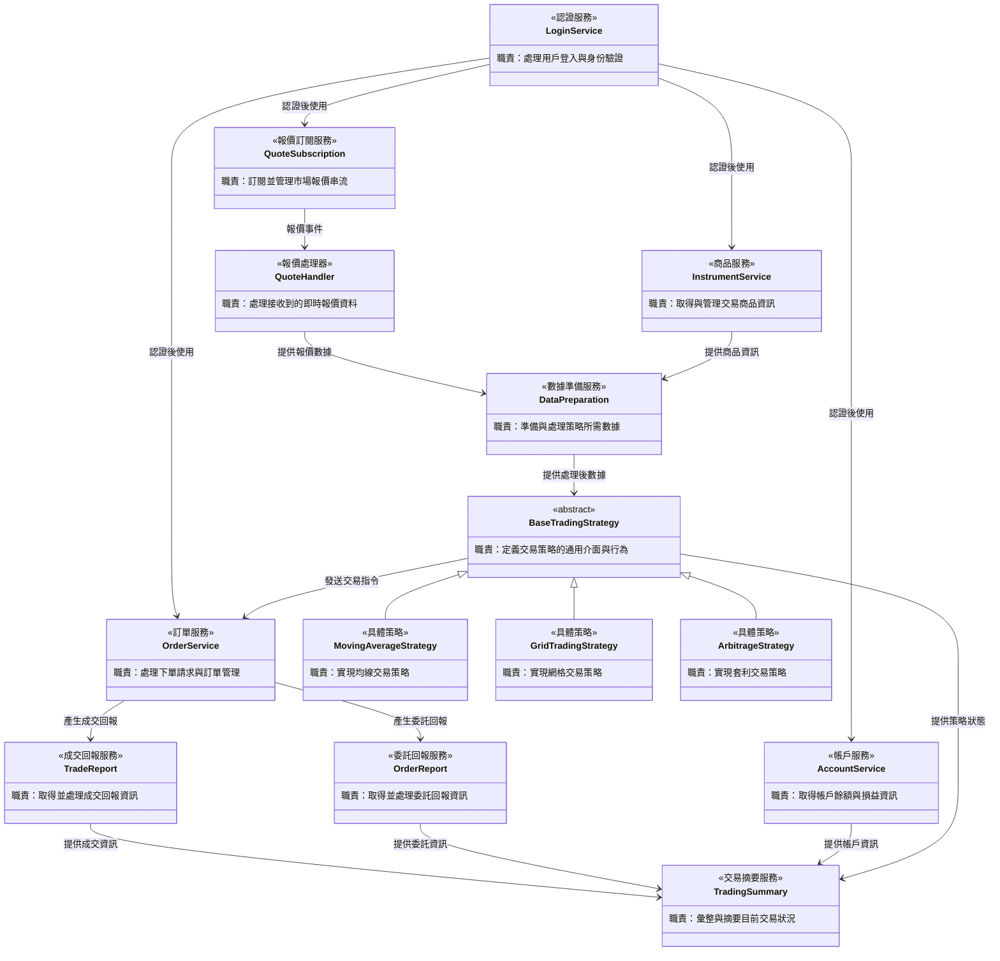

# 量化交易系統 - 類別圖

## 系統架構概覽

本系統採用模組化設計，將量化交易的各項功能分離為獨立的類別，以提高系統的可維護性和擴展性。

## 類別圖



## 類別職責說明

| 類別名稱 | 職責描述 |
|---------|---------|
| LoginService | 處理用戶登入與身份驗證，確保系統安全性 |
| InstrumentService | 取得與管理交易商品資訊，包括商品規格、合約細節等 |
| QuoteSubscription | 訂閱並管理市場報價串流，處理訂閱生命週期 |
| QuoteHandler | 處理接收到的即時報價資料，作為報價事件的回調處理器 |
| OrderService | 處理下單請求與訂單管理，包括委託、修改、取消等操作 |
| TradeReport | 取得並處理成交回報資訊，追蹤訂單執行狀況 |
| OrderReport | 取得並處理委託回報資訊，監控訂單狀態變化 |
| AccountService | 取得帳戶餘額、已實現損益與未實現損益等帳戶資訊 |
| **BaseTradingStrategy** | **（抽象基類）定義交易策略的通用介面與行為，規範所有策略的共同方法** |
| MovingAverageStrategy | 實現均線交易策略，根據移動平均線交叉產生交易信號 |
| GridTradingStrategy | 實現網格交易策略，在價格區間內進行高拋低吸 |
| ArbitrageStrategy | 實現套利交易策略，利用不同市場或商品間的價差獲利 |
| DataPreparation | 準備與處理策略所需數據，包括數據清洗、特徵工程等 |
| TradingSummary | 彙整與摘要目前交易狀況，提供系統整體運行概覽 |

## 設計說明

### 核心流程

1. **認證階段**：透過 `LoginService` 完成身份驗證
2. **數據階段**：使用 `InstrumentService` 取得商品資訊，透過 `QuoteSubscription` 訂閱報價
3. **處理階段**：`QuoteHandler` 接收報價，`DataPreparation` 準備策略數據
4. **策略階段**：具體策略（如 `MovingAverageStrategy`）根據數據做出交易決策
5. **執行階段**：`OrderService` 執行交易指令
6. **監控階段**：`TradeReport`、`OrderReport`、`AccountService` 追蹤執行結果
7. **彙總階段**：`TradingSummary` 提供整體交易狀況摘要

### 策略模式設計

系統採用**策略模式 (Strategy Pattern)**，透過 `BaseTradingStrategy` 抽象基類實現：

- **抽象層**：`BaseTradingStrategy` 定義策略的共同介面
- **具體實作**：
  - `MovingAverageStrategy`：均線策略
  - `GridTradingStrategy`：網格策略
  - `ArbitrageStrategy`：套利策略
- **優勢**：
  - 可輕鬆新增新策略而不修改現有程式碼
  - 策略之間可動態切換
  - 符合開放封閉原則

### 設計原則

- **單一職責**：每個類別專注於單一功能領域
- **鬆散耦合**：透過明確的介面降低類別間的依賴
- **高內聚性**：相關功能集中在同一類別中
- **可擴展性**：預留擴展空間，方便未來新增功能

## SOLID 原則檢視

### ✅ 單一職責原則 (S - Single Responsibility Principle)
- 每個類別都有明確的單一職責
- 職責劃分清晰，符合此原則
- **評分：優秀**

### ✅ 開放封閉原則 (O - Open-Closed Principle)
- 已實現 `BaseTradingStrategy` 抽象基類
- 可透過繼承新增策略，無需修改現有程式碼
- 策略擴展範例：
  ```
  BaseTradingStrategy <|-- 新策略類別
  ```
- **評分：符合**（進一步可為其他服務引入介面）

### ✅ 里氏替換原則 (L - Liskov Substitution Principle)
- `MovingAverageStrategy`、`GridTradingStrategy`、`ArbitrageStrategy` 都可以替換 `BaseTradingStrategy`
- 所有具體策略都遵循相同的契約
- **評分：符合**

### ⚠️ 介面隔離原則 (I - Interface Segregation Principle)
**目前狀況：**
- 策略部分已透過抽象基類實現良好的介面設計
- `TradingSummary` 依賴多個服務，可能接收過多資訊

**改進建議：**
- 考慮為核心服務（如 `OrderService`、`AccountService`）定義精簡介面
- `TradingSummary` 可透過事件訂閱機制取得所需資訊
- **評分：部分符合**

### ⚠️ 依賴反轉原則 (D - Dependency Inversion Principle)
**目前狀況：**
- ✅ `DataPreparation` 和 `TradingSummary` 依賴 `BaseTradingStrategy` 抽象，而非具體策略
- ❌ 其他類別之間仍直接依賴具體實作

**改進建議：**
- 為關鍵服務引入介面：
  - `IOrderService`：訂單服務介面
  - `IAccountService`：帳戶服務介面
  - `IQuoteHandler`：報價處理介面
- 讓 `BaseTradingStrategy` 依賴 `IOrderService` 而非具體的 `OrderService`
- **評分：部分符合**

### 改進優先順序

根據實務需求和避免過度設計的原則，建議依序進行：

1. **階段一（已完成）**：✅ 實現策略模式，引入 `BaseTradingStrategy`
2. **階段二（建議）**：為 `OrderService` 引入介面，因為它是策略的主要依賴
3. **階段三（選擇性）**：根據實際需求，為其他核心服務引入介面

### 總結
目前設計在 **S（單一職責）**、**O（開放封閉）**、**L（里氏替換）** 三個原則上表現優秀，特別是透過引入 `BaseTradingStrategy` 抽象基類，大幅提升了系統的可擴展性。在 **I（介面隔離）** 和 **D（依賴反轉）** 原則上仍有改進空間，但已達到實務上可接受的水準，符合「避免過度設計」的專案規範。

