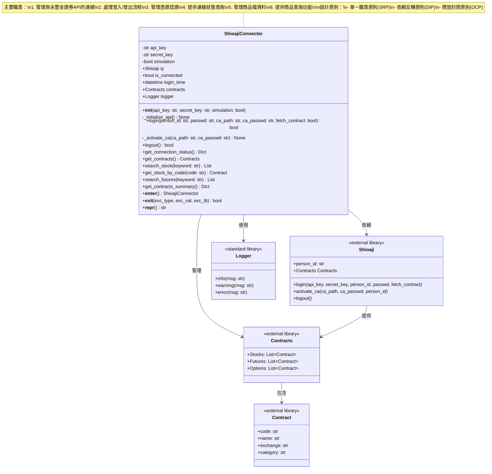
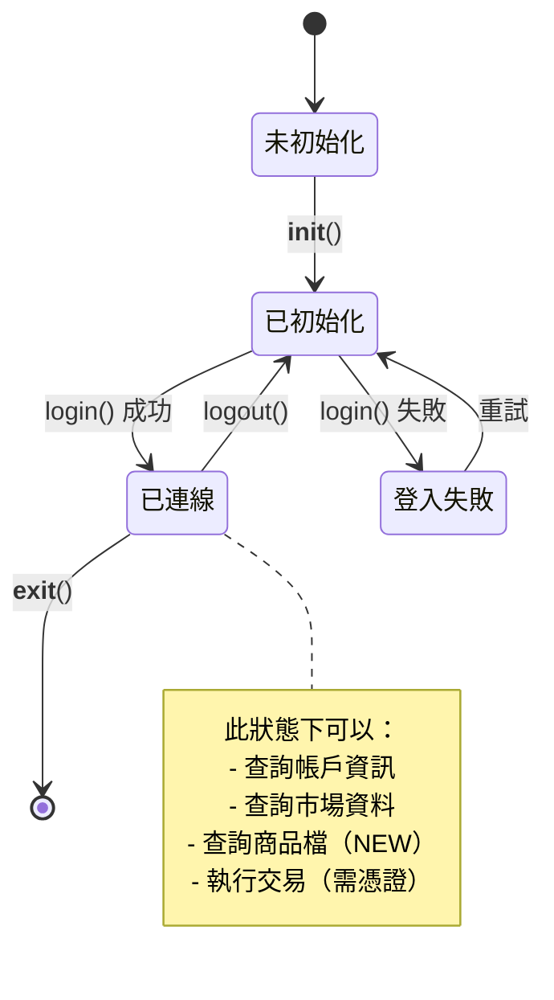
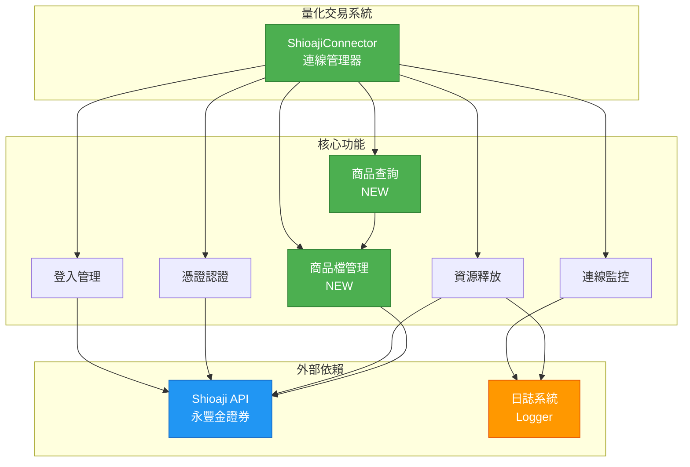
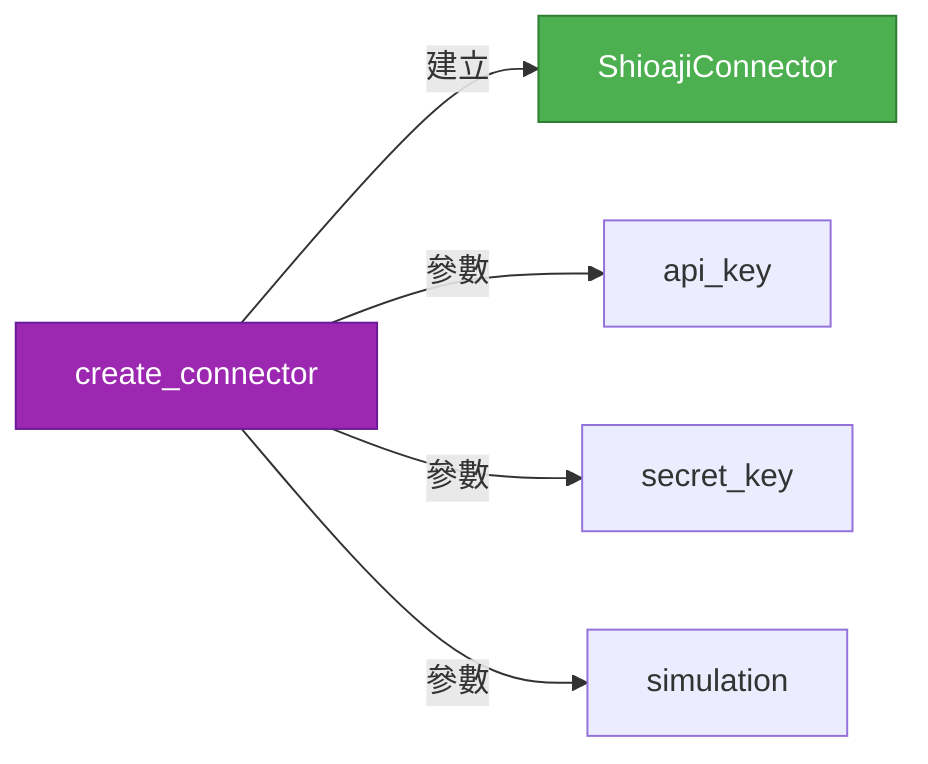
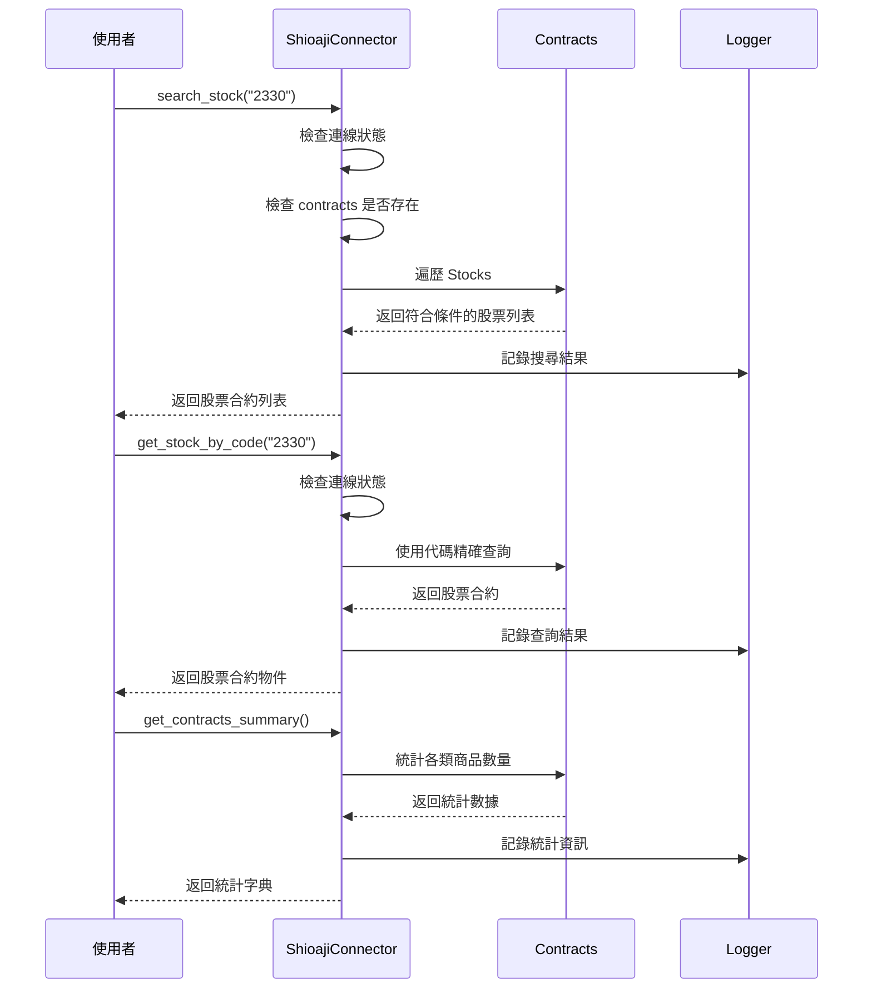
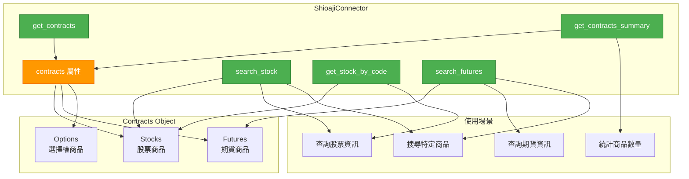
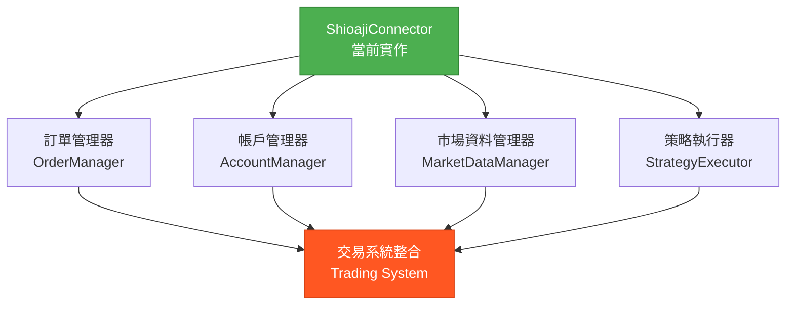

# 量化交易系統 - 類別圖

## Shioaji 連線管理模組類別圖

本文件展示量化交易系統中 Shioaji 連線管理模組的類別結構與關係。

### 主要類別圖



### 類別詳細說明

#### ShioajiConnector (Shioaji 連線器)

**職責：**
- 管理與永豐金證券 Shioaji API 的連線生命週期
- 封裝登入、登出、憑證認證等操作
- 提供連線狀態查詢功能
- **管理商品檔資料（新增）**
- **提供股票、期貨等商品查詢功能（新增）**
- 支援 Context Manager 模式 (with 語句)

**設計模式：**
- **Facade Pattern (外觀模式)**：簡化 Shioaji API 的複雜介面
- **Context Manager Pattern**：支援資源自動管理

**SOLID 原則體現：**
1. **單一職責原則 (SRP)**：專注於連線管理，不處理交易邏輯
2. **開放封閉原則 (OCP)**：可透過繼承擴展功能，無需修改原有程式碼
3. **依賴反轉原則 (DIP)**：依賴於 Shioaji 抽象介面，而非具體實作

---

### 時序圖：登入流程

```mermaid
sequenceDiagram
    participant User as 使用者
    participant Connector as ShioajiConnector
    participant API as Shioaji API
    participant Logger as Logger
    
    User->>Connector: __init__(api_key, secret_key)
    Connector->>API: 建立 Shioaji 實例
    Connector->>Logger: 記錄初始化成功
    
    User->>Connector: login(person_id, passwd)
    Connector->>Connector: 驗證參數
    Connector->>API: login(credentials)
    API-->>Connector: 返回帳戶資訊
    Connector->>Connector: 更新連線狀態
    Connector->>Logger: 記錄登入成功
    Connector-->>User: 返回 True
    
    opt 如果提供憑證
        Connector->>API: activate_ca(ca_path, ca_passwd)
        API-->>Connector: 憑證啟用成功
        Connector->>Logger: 記錄憑證啟用
    end
    
    opt 如果下載商品檔
        Connector->>API: 取得 Contracts
        API-->>Connector: 返回商品檔資料
        Connector->>Connector: 儲存至 contracts 屬性
        Connector->>Logger: 記錄商品檔載入完成
    end
```



---

### 狀態圖：連線狀態管理



---

### 使用案例圖



---

### 模組便利函數



---

### 商品檔查詢時序圖（新增功能）



---

### 商品檔功能架構圖（新增）



---

## 設計特點總結

### 1. 符合 SOLID 原則
- ✅ **S (Single Responsibility)**：單一職責，專注連線管理
- ✅ **O (Open/Closed)**：開放擴展，封閉修改
- ✅ **L (Liskov Substitution)**：可被子類別替換
- ✅ **I (Interface Segregation)**：介面精簡，方法職責明確
- ✅ **D (Dependency Inversion)**：依賴抽象而非具體實作

### 2. 良好的錯誤處理
- 所有公開方法都有完整的錯誤處理
- 使用自訂異常提供清晰的錯誤訊息
- 完整的日誌記錄便於問題追蹤

### 3. 完整的文件
- 每個方法都有詳細的 docstring
- 包含參數說明、返回值、異常、使用範例
- 符合 Python 文件規範

### 4. 易用性設計
- 支援 Context Manager (with 語句)
- 提供便利函數 `create_connector`
- 清晰的狀態管理和查詢介面
- **多種商品查詢方式（關鍵字搜尋、精確查詢）**
- **直接訪問 contracts 屬性進行進階操作**

### 5. 可測試性
- 職責單一，易於單元測試
- 依賴注入設計，便於 Mock
- 清晰的狀態轉換邏輯

---

## 未來擴展方向



---

---

## v2.0 更新內容（2025-10-06）

### 新增功能：商品檔管理與查詢

#### 1. 新增屬性
- `contracts` (Contracts): 儲存所有可交易商品的資料物件

#### 2. 新增方法

| 方法名稱 | 功能說明 | 返回類型 |
|---------|---------|----------|
| `get_contracts()` | 取得所有商品檔物件 | Contracts |
| `search_stock(keyword)` | 使用關鍵字搜尋股票 | List[Contract] |
| `get_stock_by_code(code)` | 精確查詢特定股票代碼 | Contract |
| `search_futures(keyword)` | 使用關鍵字搜尋期貨 | List[Contract] |
| `get_contracts_summary()` | 取得商品統計摘要 | Dict[str, int] |

#### 3. 使用範例

```python
# 登入並載入商品檔
connector = ShioajiConnector(simulation=True)
connector.login(person_id="ID", passwd="PWD", fetch_contract=True)

# 搜尋股票
stocks = connector.search_stock("2330")
for stock in stocks:
    print(f"{stock.code} {stock.name}")

# 精確查詢
stock = connector.get_stock_by_code("2330")
print(f"股票: {stock.code} {stock.name}")

# 查看統計
summary = connector.get_contracts_summary()
print(f"股票數量: {summary['stocks']}")

# 直接使用 contracts
all_stocks = connector.contracts.Stocks
```

#### 4. 設計考量

- **單一職責延伸**：商品檔管理屬於連線管理的延伸，符合類別職責
- **封裝性**：提供高階查詢方法，隱藏底層複雜度
- **靈活性**：同時支援高階方法和直接訪問 contracts
- **錯誤處理**：完整的連線狀態和商品檔載入檢查
- **效能考量**：登入時一次性載入，避免重複查詢

---

**文件版本：** 2.0  
**建立日期：** 2025-10-06  
**作者：** Trading System Team  
**最後更新：** 2025-10-06 (新增商品檔功能)
