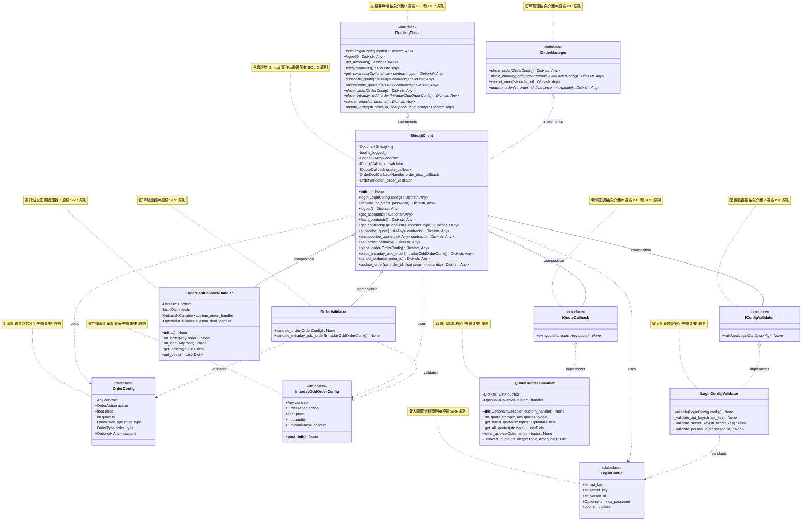

# 永豐 Shioaji 交易系統類別圖

## 類別圖



## 類別說明

### LoginConfig
**職責**: 資料傳輸物件 (DTO)，用於封裝登入配置參數

**屬性**:
- `api_key`: API 金鑰
- `secret_key`: 密鑰
- `person_id`: 身分證字號或統一編號
- `ca_password`: 憑證密碼（可選）
- `simulation`: 是否使用模擬交易環境

**設計原則**: 
- **單一職責原則 (SRP)**: 僅負責存儲配置資料
- 使用 `@dataclass` 減少樣板代碼

### ITradingClient
**職責**: 定義交易客戶端的抽象介面

**方法**:
- `login()`: 執行登入操作（抽象方法）
- `logout()`: 執行登出操作（抽象方法）
- `get_accounts()`: 取得帳戶資訊（抽象方法）
- `fetch_contracts()`: 取得商品檔（抽象方法）
- `get_contracts()`: 取得已載入的商品檔資料（抽象方法）
- `subscribe_quote()`: 訂閱報價（抽象方法）
- `unsubscribe_quote()`: 取消訂閱報價（抽象方法）

**設計原則**:
- **依賴反轉原則 (DIP)**: 高層模組依賴抽象而非具體實作
- **開放封閉原則 (OCP)**: 對擴展開放，對修改封閉

### IConfigValidator
**職責**: 定義配置驗證器的抽象介面

**方法**:
- `validate()`: 驗證配置有效性（抽象方法）

**設計原則**:
- **介面隔離原則 (ISP)**: 提供精簡的介面，僅包含驗證功能
- **單一職責原則 (SRP)**: 僅負責驗證職責

### IQuoteCallback
**職責**: 定義報價回調處理的抽象介面

**方法**:
- `on_quote()`: 處理報價回調（抽象方法）

**設計原則**:
- **介面隔離原則 (ISP)**: 精簡的回調介面
- **單一職責原則 (SRP)**: 僅負責報價回調處理

### IOrderManager
**職責**: 定義訂單管理的抽象介面

**方法**:
- `place_order()`: 下一般股票訂單（抽象方法）
- `place_intraday_odd_order()`: 下盤中零股訂單（抽象方法）
- `cancel_order()`: 取消訂單（抽象方法）
- `update_order()`: 修改訂單（抽象方法）

**設計原則**:
- **介面隔離原則 (ISP)**: 僅定義訂單相關方法
- **單一職責原則 (SRP)**: 僅負責訂單管理職責

### OrderConfig
**職責**: 資料傳輸物件 (DTO)，用於封裝一般訂單配置參數

**屬性**:
- `contract`: 商品合約物件
- `action`: 買賣方向（買進/賣出）
- `price`: 價格
- `quantity`: 數量
- `price_type`: 價格類型（限價/市價）
- `order_type`: 訂單類型（當日有效/立即成交否則取消/全部成交否則取消）
- `account`: 交易帳戶（可選）

**設計原則**:
- **單一職責原則 (SRP)**: 僅負責存儲訂單配置資料

### IntradayOddOrderConfig
**職責**: 資料傳輸物件 (DTO)，用於封裝盤中零股訂單配置參數

**屬性**:
- `contract`: 商品合約物件
- `action`: 買賣方向
- `price`: 價格
- `quantity`: 數量（必須小於1000股）
- `account`: 交易帳戶（可選）

**設計原則**:
- **單一職責原則 (SRP)**: 僅負責存儲零股訂單配置資料
- 包含資料驗證邏輯（__post_init__）

### ShioajiClient
**職責**: 永豐證券 Shioaji API 的具體實作

**屬性**:
- `sj`: Shioaji API 實例
- `is_logged_in`: 登入狀態標記
- `contract`: 商品檔資料
- `_validator`: 配置驗證器（依賴注入）
- `quote_callback`: 報價回調處理器（依賴注入）
- `order_deal_callback`: 委託成交回調處理器（依賴注入）

**方法**:
- `__init__()`: 初始化客戶端，支援依賴注入
- `login()`: 執行登入操作
- `activate_ca()`: 啟用憑證
- `logout()`: 執行登出操作
- `get_accounts()`: 取得帳戶資訊
- `fetch_contracts()`: 取得商品檔
- `get_contracts()`: 取得已載入的商品檔資料
- `subscribe_quote()`: 訂閱報價
- `unsubscribe_quote()`: 取消訂閱報價
- `set_order_callback()`: 設置委託成交回調
- `place_order()`: 下一般股票訂單
- `place_intraday_odd_order()`: 下盤中零股訂單
- `cancel_order()`: 取消訂單
- `update_order()`: 修改訂單

**設計原則**:
- **單一職責原則 (SRP)**: 僅負責與 Shioaji API 的通訊
- **開放封閉原則 (OCP)**: 透過介面實作擴展功能
- **里氏替換原則 (LSP)**: 可替換為任何 ITradingClient 實作
- **介面隔離原則 (ISP)**: 實作必要的介面方法
- **依賴反轉原則 (DIP)**: 依賴 IConfigValidator 抽象介面

### LoginConfigValidator
**職責**: 實作登入配置的驗證邏輯

**方法**:
- `validate()`: 驗證配置有效性
- `_validate_api_key()`: 驗證 API 金鑰
- `_validate_secret_key()`: 驗證密鑰
- `_validate_person_id()`: 驗證身分證字號

**設計原則**:
- **單一職責原則 (SRP)**: 僅負責配置驗證
- **開放封閉原則 (OCP)**: 可擴展新的驗證規則

### QuoteCallbackHandler
**職責**: 實作報價回調處理邏輯

**屬性**:
- `quotes`: 儲存接收到的報價資料
- `custom_handler`: 自訂的報價處理函數

**方法**:
- `__init__()`: 初始化處理器，支援自訂處理函數
- `on_quote()`: 處理報價回調
- `get_latest_quote()`: 取得指定主題的最新報價
- `get_all_quotes()`: 取得指定主題的所有報價歷史
- `clear_quotes()`: 清除報價資料
- `_convert_quote_to_dict()`: 將報價物件轉換為字典

**設計原則**:
- **單一職責原則 (SRP)**: 僅負責報價回調處理
- **開放封閉原則 (OCP)**: 支援自訂處理函數擴展功能

### OrderDealCallbackHandler
**職責**: 實作委託成交回調處理邏輯

**屬性**:
- `orders`: 儲存接收到的委託資料
- `deals`: 儲存接收到的成交資料
- `custom_order_handler`: 自訂的委託處理函數
- `custom_deal_handler`: 自訂的成交處理函數

**方法**:
- `__init__()`: 初始化處理器，支援自訂處理函數
- `on_order()`: 處理委託回調
- `on_deal()`: 處理成交回調
- `get_orders()`: 取得所有委託記錄
- `get_deals()`: 取得所有成交記錄

**設計原則**:
- **單一職責原則 (SRP)**: 僅負責委託成交回調處理
- **開放封閉原則 (OCP)**: 支援自訂處理函數擴展功能

### OrderValidator
**職責**: 實作訂單配置驗證邏輯

**方法**:
- `validate_order()`: 驗證一般訂單配置
- `validate_intraday_odd_order()`: 驗證盤中零股訂單配置

**設計原則**:
- **單一職責原則 (SRP)**: 僅負責訂單驗證
- **開放封閉原則 (OCP)**: 可擴展新的驗證規則

## SOLID 原則應用

### 1. 單一職責原則 (Single Responsibility Principle)
- `LoginConfig`: 僅負責存儲登入配置資料
- `OrderConfig`: 僅負責存儲訂單配置資料
- `IntradayOddOrderConfig`: 僅負責存儲零股訂單配置資料
- `LoginConfigValidator`: 僅負責驗證登入配置
- `OrderValidator`: 僅負責驗證訂單配置
- `ShioajiClient`: 僅負責與 Shioaji API 通訊
- `QuoteCallbackHandler`: 僅負責報價回調處理
- `OrderDealCallbackHandler`: 僅負責委託成交回調處理

### 2. 開放封閉原則 (Open/Closed Principle)
- 透過 `ITradingClient` 介面，可輕易擴展支援其他券商
- 透過 `IOrderManager` 介面，可擴展訂單管理功能
- 透過 `IConfigValidator` 介面，可自訂驗證邏輯
- 透過 `IQuoteCallback` 介面，可自訂報價處理邏輯
- 透過自訂處理函數，可擴展回調處理功能
- 無需修改現有代碼即可新增功能

### 3. 里氏替換原則 (Liskov Substitution Principle)
- `ShioajiClient` 可完全替換為任何實作 `ITradingClient` 的類別
- `LoginConfigValidator` 可替換為任何實作 `IConfigValidator` 的類別
- `QuoteCallbackHandler` 可替換為任何實作 `IQuoteCallback` 的類別

### 4. 介面隔離原則 (Interface Segregation Principle)
- `ITradingClient` 僅定義交易相關的核心方法
- `IOrderManager` 僅定義訂單管理相關的方法
- `IConfigValidator` 僅定義驗證相關的方法
- `IQuoteCallback` 僅定義報價回調相關的方法
- 介面精簡，避免臃腫

### 5. 依賴反轉原則 (Dependency Inversion Principle)
- `ShioajiClient` 依賴 `IConfigValidator`、`IQuoteCallback`、`IOrderManager` 等抽象介面，而非具體實作
- 透過建構子注入，支援依賴注入模式
- 高層模組不依賴低層模組，兩者都依賴抽象

## 設計模式

### 1. 外觀模式 (Facade Pattern)
`ShioajiClient` 類別作為外觀，簡化了與複雜的 Shioaji API 的互動。

### 2. 資料傳輸物件 (DTO Pattern)
`LoginConfig` 作為 DTO，在不同層級之間傳遞資料。

### 3. 策略模式 (Strategy Pattern)
透過 `IConfigValidator` 介面，可注入不同的驗證策略。

### 4. 依賴注入 (Dependency Injection)
`ShioajiClient` 的建構子接受 `IConfigValidator` 參數，支援依賴注入。

## 錯誤處理

所有公開方法都返回包含成功狀態和錯誤訊息的字典，遵循一致的錯誤處理模式：

```python
{
    "success": bool,
    "message": str,
    "error": Optional[str]
}
```

## 使用範例

### 基本使用
```python
from shioaji_client import ShioajiClient
from trading_client_interface import LoginConfig

# 建立配置
config = LoginConfig(
    api_key="YOUR_API_KEY",
    secret_key="YOUR_SECRET_KEY",
    person_id="A123456789",
    simulation=True
)

# 建立客戶端並登入（使用預設驗證器）
client = ShioajiClient()
result = client.login(config)

if result["success"]:
    print("登入成功")
    
    # 取得商品檔
    contract_result = client.fetch_contracts()
    if contract_result["success"]:
        print("商品檔載入成功")
        
        # 取得所有商品
        all_contracts = client.get_contracts()
        
        # 取得股票商品
        stocks = client.get_contracts("Stocks")
        print(f"股票商品數量: {len(stocks)}")
        
        # 取得期貨商品
        futures = client.get_contracts("Futures")
        print(f"期貨商品數量: {len(futures)}")
    
    # 啟用憑證（如需下單）
    ca_result = client.activate_ca("YOUR_CA_PASSWORD")
    
    # 取得帳戶資訊
    accounts = client.get_accounts()
    print(accounts)
    
    # 登出
    client.logout()
else:
    print(f"登入失敗: {result['error']}")
```

### 依賴注入使用
```python
from shioaji_client import ShioajiClient
from trading_client_interface import LoginConfig
from config_validator import LoginConfigValidator

# 建立自訂驗證器
custom_validator = LoginConfigValidator()

# 注入驗證器
client = ShioajiClient(validator=custom_validator)

# 其餘操作相同
config = LoginConfig(
    api_key="YOUR_API_KEY",
    secret_key="YOUR_SECRET_KEY",
    person_id="A123456789"
)
result = client.login(config)
```

### 多型使用（遵循 LSP）
```python
from trading_client_interface import ITradingClient, LoginConfig
from shioaji_client import ShioajiClient

def process_trading(client: ITradingClient, config: LoginConfig):
    """可接受任何 ITradingClient 實作"""
    result = client.login(config)
    if result["success"]:
        # 載入商品檔
        client.fetch_contracts()
        # 取得帳戶資訊
        accounts = client.get_accounts()
        client.logout()
    return result

# 使用 ShioajiClient
client = ShioajiClient()
config = LoginConfig(
    api_key="YOUR_API_KEY",
    secret_key="YOUR_SECRET_KEY",
    person_id="A123456789"
)
process_trading(client, config)
```
