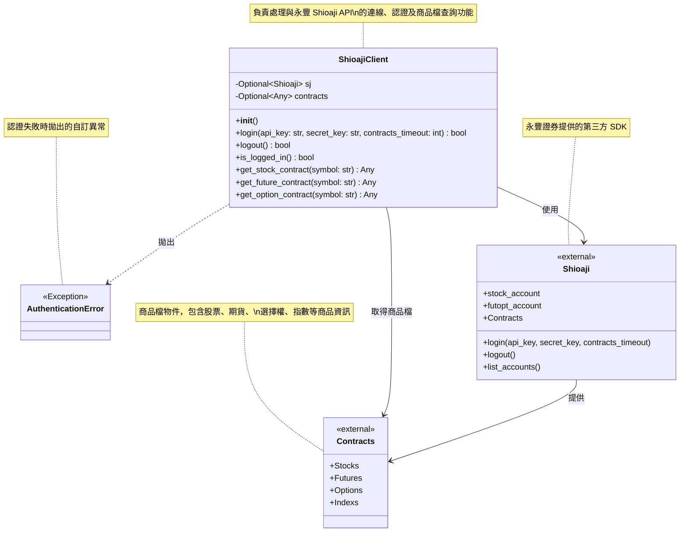

# 量化交易系統類別圖

## 系統類別關係圖

## 類別說明

### ShioajiClient
- **職責**: 封裝 Shioaji API 的登入、登出及商品檔查詢功能
- **屬性**:
  - `sj`: 儲存 Shioaji API 實例，登入成功後可供其他功能使用
  - `contracts`: 儲存商品檔物件，登入成功後自動載入
- **方法**:
  - `login()`: 使用 API Key 進行登入認證，並自動載入商品檔
  - `logout()`: 登出並清理連線與商品檔
  - `is_logged_in()`: 檢查當前登入狀態
  - `get_stock_contract()`: 取得指定股票商品檔（支援 TSE/OTC）
  - `get_future_contract()`: 取得指定期貨商品檔
  - `get_option_contract()`: 取得指定選擇權商品檔

### AuthenticationError
- **職責**: 提供明確的認證錯誤異常類型
- **繼承**: Python 內建的 Exception 類別
- **用途**: 與一般的連線錯誤或其他錯誤區分

### Shioaji（外部依賴）
- **來源**: 永豐證券提供的 Python SDK
- **職責**: 提供交易 API 的底層實作
- **版本要求**: >= 1.1.0
- **重要屬性**: Contracts（商品檔物件）

### Contracts（外部依賴）
- **來源**: Shioaji SDK 提供的商品檔物件
- **職責**: 儲存所有可交易的商品資訊
- **包含商品類型**:
  - `Stocks`: 股票（TSE 上市、OTC 上櫃）
  - `Futures`: 期貨
  - `Options`: 選擇權
  - `Indexs`: 指數（僅供行情訂閱，不可下單）
- **更新時間**:
  - 07:50 期貨商品檔更新
  - 08:00 全市場商品檔更新
  - 14:45 期貨夜盤商品檔更新
  - 17:15 期貨夜盤商品檔更新
