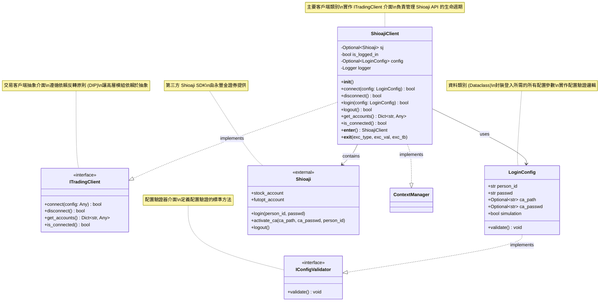
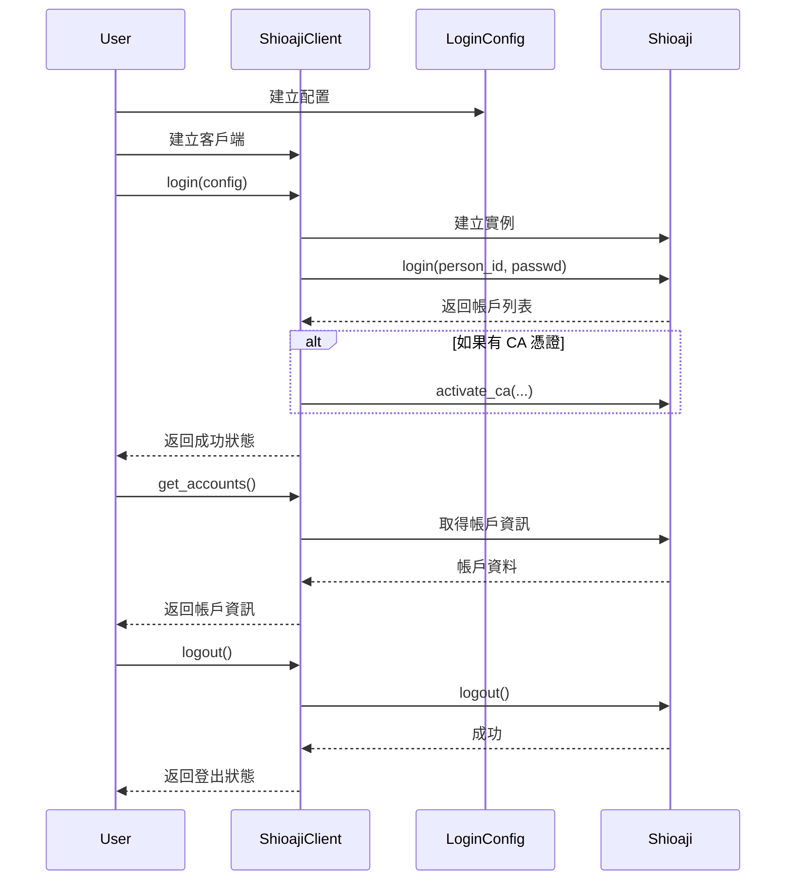

# Shioaji 交易系統類別圖

本文件使用 Mermaid 語法描述 Shioaji 交易客戶端的類別結構。

## 類別圖

## 類別說明

### IConfigValidator (介面)
- **用途**: 定義配置驗證的標準介面
- **設計模式**: Interface Segregation Principle (ISP)
- **方法**:
  - `validate()`: 驗證配置的有效性

### ITradingClient (介面)
- **用途**: 定義交易客戶端的標準介面
- **設計模式**: Dependency Inversion Principle (DIP)
- **方法**:
  - `connect(config)`: 連接到交易系統
  - `disconnect()`: 斷開連線
  - `get_accounts()`: 取得帳戶資訊
  - `is_connected()`: 檢查連線狀態
- **優點**:
  - 高層模組依賴於抽象介面，而非具體實作
  - 便於測試（可使用 Mock 物件）
  - 支援多型性，可替換不同的實作

### LoginConfig
- **用途**: 封裝登入配置資訊
- **設計模式**: Data Transfer Object (DTO)
- **實作介面**: IConfigValidator
- **屬性**:
  - `person_id`: 使用者身分證字號或統一編號
  - `passwd`: 使用者密碼
  - `ca_path`: CA 憑證檔案路徑（可選）
  - `ca_passwd`: CA 憑證密碼（可選）
  - `simulation`: 是否使用模擬環境
- **方法**:
  - `validate()`: 驗證配置參數的有效性

### ShioajiClient
- **用途**: Shioaji API 的封裝類別
- **實作介面**: ITradingClient
- **設計模式**: 
  - Facade Pattern (外觀模式)
  - Context Manager Pattern
  - Adapter Pattern (適配器模式)
- **主要職責**:
  - 管理 Shioaji API 實例的生命週期
  - 提供統一的登入/登出介面
  - 處理錯誤和日誌記錄
  - 將 Shioaji SDK 適配到 ITradingClient 介面
- **屬性**:
  - `sj`: Shioaji API 實例（登入後可用）
  - `is_logged_in`: 登入狀態標記
  - `config`: 登入配置資訊
  - `logger`: 日誌記錄器
- **方法**:
  - `connect()`: 連接到交易系統（實作 ITradingClient）
  - `disconnect()`: 斷開連線（實作 ITradingClient）
  - `login()`: 執行登入操作
  - `logout()`: 執行登出操作
  - `get_accounts()`: 取得帳戶資訊（實作 ITradingClient）
  - `is_connected()`: 檢查連線狀態（實作 ITradingClient）
  - `__enter__()`, `__exit__()`: 支援 with 語句的 context manager

### Shioaji
- **用途**: 第三方 SDK
- **來源**: 永豐金證券
- **主要功能**: 提供台灣金融市場交易 API

## 設計特點 - SOLID 原則實踐

### 1. 單一職責原則 (Single Responsibility Principle) ✅
- **IConfigValidator**: 只定義配置驗證介面
- **ITradingClient**: 只定義交易客戶端介面
- **LoginConfig**: 只負責封裝和驗證配置資料
- **ShioajiClient**: 只負責管理 Shioaji API 的生命週期和基本操作
- **職責分離明確**: 配置驗證、交易操作、日誌記錄各司其職

### 2. 開放封閉原則 (Open/Closed Principle) ✅
- 通過抽象介面 `ITradingClient` 和 `IConfigValidator` 實現對擴展開放
- 可以創建新的交易客戶端實作而不需修改現有程式碼
- 核心邏輯對修改封閉，對擴展開放
- 範例：可以實作 `MockTradingClient` 用於測試，無需修改原有程式碼

### 3. 里氏替換原則 (Liskov Substitution Principle) ✅
- 所有實作 `ITradingClient` 的類別都可以互相替換
- 實作標準的 Context Manager 協議
- 可以在任何需要 `ITradingClient` 的地方使用 `ShioajiClient`
- 子類別不會破壞父類別的行為契約

### 4. 介面隔離原則 (Interface Segregation Principle) ✅
- `ITradingClient` 只包含交易客戶端必需的方法
- `IConfigValidator` 只包含配置驗證必需的方法
- 介面精簡、專注，客戶端不需依賴不使用的方法
- 避免"胖介面"問題

### 5. 依賴反轉原則 (Dependency Inversion Principle) ✅
- **高層模組依賴抽象**: 使用 `ITradingClient` 介面而非具體實作
- **抽象不依賴細節**: `ITradingClient` 不依賴 Shioaji SDK 的具體實作
- **細節依賴抽象**: `ShioajiClient` 實作 `ITradingClient` 介面
- **便於測試**: 可以使用 Mock 物件替換真實的 Shioaji SDK
- **降低耦合**: 通過 `LoginConfig` 資料類別解耦配置和實作

## SOLID 原則帶來的好處

1. **可測試性 (Testability)**
   - 透過抽象介面，可以輕鬆使用 Mock 物件進行單元測試
   - 不需要真實的 Shioaji API 連線即可測試業務邏輯

2. **可維護性 (Maintainability)**
   - 職責分離明確，修改某一部分不影響其他部分
   - 程式碼結構清晰，易於理解和修改

3. **可擴展性 (Extensibility)**
   - 可以輕鬆添加新的交易客戶端實作（如其他券商的 API）
   - 可以通過繼承或組合擴展功能

4. **可重用性 (Reusability)**
   - 抽象介面可以在不同專案中重用
   - 配置類別和驗證邏輯可以獨立使用

5. **低耦合高內聚 (Low Coupling, High Cohesion)**
   - 模組間依賴關係清晰
   - 每個類別內部高度內聚

## 使用流程圖

## 錯誤處理流程

## 擴展建議

未來可以考慮以下擴展：

1. **策略模式**: 支援不同的登入策略（基本登入、CA 登入、OAuth 等）
2. **觀察者模式**: 實作事件監聽機制，監控帳戶狀態變化
3. **工廠模式**: 建立不同類型的交易客戶端（股票、期貨、選擇權）
4. **裝飾器模式**: 添加交易記錄、風險控制等額外功能
5. **命令模式**: 封裝交易指令，支援撤銷、重做等操作
