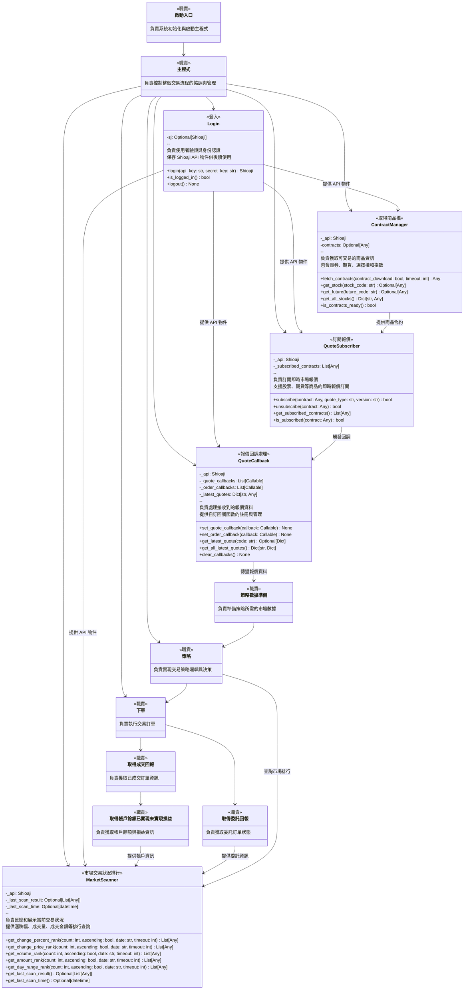

# 量化交易系統類別圖

## 系統架構概覽

本文件描述量化交易系統的類別架構，展示系統中各個類別的職責與關係。

## 類別圖

## 類別職責說明

| 類別名稱 | 職責描述 | 實作狀態 |
|---------|---------|----------|
| 啟動入口 | 負責系統初始化與啟動主程式 | 待實作 |
| 主程式 | 負責控制整個交易流程的協調與管理 | 待實作 |
| Login | 負責使用者驗證與身份認證，保存 Shioaji API 物件供後續使用 | ✅ 已實作 |
| ContractManager | 負責獲取可交易的商品資訊，包含證券、期貨、選擇權和指數 | ✅ 已實作 |
| QuoteSubscriber | 負責訂閱即時市場報價，支援股票、期貨等商品的即時報價訂閱 | ✅ 已實作 |
| QuoteCallback | 負責處理接收到的報價資料，提供自訂回調函數的註冊與管理 | ✅ 已實作 |
| 下單 | 負責執行交易訂單 | 待實作 |
| 取得成交回報 | 負責獲取已成交訂單資訊 | 待實作 |
| 取得委託回報 | 負責獲取委託訂單狀態 | 待實作 |
| 取得帳戶餘額已實現未實現損益 | 負責獲取帳戶餘額與損益資訊 | 待實作 |
| 策略數據準備 | 負責準備策略所需的市場數據 | 待實作 |
| 策略 | 負責實現交易策略邏輯與決策 | 待實作 |
| MarketScanner | 負責匯總和展示當前交易狀況，提供漲跌幅、成交量、成交金額等排行查詢 | ✅ 已實作 |

## 系統流程說明

1. **系統啟動**：啟動入口初始化並啟動主程式
2. **身份驗證**：主程式呼叫登入模組進行身份認證
3. **數據獲取**：取得商品檔資訊並訂閱市場報價
4. **報價處理**：報價Callback接收數據並傳遞給策略數據準備模組
5. **策略執行**：策略模組根據準備好的數據做出交易決策
6. **訂單執行**：下單模組執行交易指令
7. **狀態監控**：取得委託回報與成交回報，更新帳戶資訊
8. **狀況摘要**：摘要模組整合所有資訊並展示當前交易狀況
