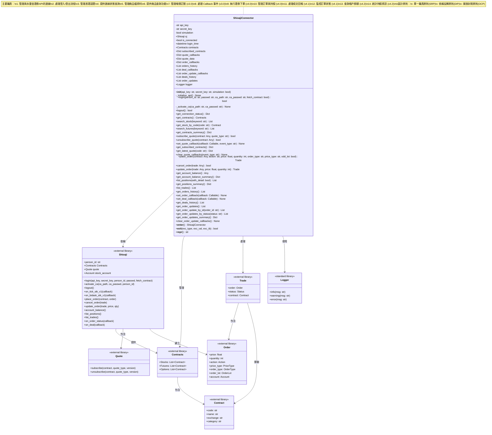

# 量化交易系統 - 類別圖

## Shioaji 連線管理模組類別圖

本文件展示量化交易系統中 Shioaji 連線管理模組的類別結構與關係。

### 主要類別圖



### 類別詳細說明

#### ShioajiConnector (Shioaji 連線器)

**職責：**
- 管理與永豐金證券 Shioaji API 的連線生命週期
- 封裝登入、登出、憑證認證等操作
- 提供連線狀態查詢功能
- **管理商品檔資料（v2.0）**
- **提供股票、期貨等商品查詢功能（v2.0）**
- **管理即時報價訂閱（v3.0）**
- **處理 Callback 事件回調（v3.0）**
- **執行證券買賣下單（v4.0）**
- **管理訂單與持股查詢（v4.0）**
- **處理成交回報與訂單狀態（v4.1 新增）**
- 支援 Context Manager 模式 (with 語句)

**設計模式：**
- **Facade Pattern (外觀模式)**：簡化 Shioaji API 的複雜介面
- **Context Manager Pattern**：支援資源自動管理

**SOLID 原則體現：**
1. **單一職責原則 (SRP)**：專注於連線管理，不處理交易邏輯
2. **開放封閉原則 (OCP)**：可透過繼承擴展功能，無需修改原有程式碼
3. **依賴反轉原則 (DIP)**：依賴於 Shioaji 抽象介面，而非具體實作

---

### 時序圖：登入流程


---

### 狀態圖：連線狀態管理


---

### 報價訂閱與 Callback 時序圖（v3.0 新增）


---

### 使用案例圖


---

### 模組便利函數


---

### 商品檔查詢時序圖（新增功能）


---

### 商品檔功能架構圖（新增）


---

## 設計特點總結

### 1. 符合 SOLID 原則
- ✅ **S (Single Responsibility)**：單一職責，專注連線管理
- ✅ **O (Open/Closed)**：開放擴展，封閉修改
- ✅ **L (Liskov Substitution)**：可被子類別替換
- ✅ **I (Interface Segregation)**：介面精簡，方法職責明確
- ✅ **D (Dependency Inversion)**：依賴抽象而非具體實作

### 2. 良好的錯誤處理
- 所有公開方法都有完整的錯誤處理
- 使用自訂異常提供清晰的錯誤訊息
- 完整的日誌記錄便於問題追蹤

### 3. 完整的文件
- 每個方法都有詳細的 docstring
- 包含參數說明、返回值、異常、使用範例
- 符合 Python 文件規範

### 4. 易用性設計
- 支援 Context Manager (with 語句)
- 提供便利函數 `create_connector`
- 清晰的狀態管理和查詢介面
- **多種商品查詢方式（關鍵字搜尋、精確查詢）**
- **直接訪問 contracts 屬性進行進階操作**

### 5. 可測試性
- 職責單一，易於單元測試
- 依賴注入設計，便於 Mock
- 清晰的狀態轉換邏輯

---

## 未來擴展方向


---

---

### 委託回報查詢架構圖（v4.1 增強）


---

### 報價訂閱架構圖（v3.0）


---

## 版本更新記錄

## v4.1 更新內容（2025-10-06）

### 新增功能：成交回報與訂單狀態監控

#### 1. 新增屬性

| 屬性名稱 | 類型 | 說明 |
|---------|------|------|
| `deal_callbacks` | List[Callable] | 成交回調函數列表 |
| `order_update_callbacks` | List[Callable] | 訂單狀態更新回調函數列表 |
| `deals_history` | List[Dict[str, Any]] | 成交歷史記錄列表 |
| `order_updates` | List[Dict[str, Any]] | 訂單更新記錄列表 |

#### 2. 新增方法

**委託回報相關（v4.1 完整）：**

| 方法名稱 | 功能說明 | 返回類型 |
|---------|---------|----------|
| `set_order_callback(callback)` | 設定委託回報回調函數 | None |
| `get_order_updates()` | 取得所有委託更新記錄 | List[Dict] |
| `get_order_update_by_id(order_id)` | 按訂單編號查詢委託記錄 | List[Dict] |
| `get_order_updates_by_status(status)` | 按狀態篩選委託記錄 | List[Dict] |
| `get_order_updates_summary()` | 統計各狀態的委託數量 | Dict[str, int] |
| `clear_order_update_callbacks()` | 清除委託回報回調 | None |

**成交回報相關（v4.1）：**

| 方法名稱 | 功能說明 | 返回類型 |
|---------|---------|----------|
| `set_deal_callback(callback)` | 設定成交回報回調函數 | None |
| `get_deals_history()` | 取得成交歷史記錄 | List[Dict] |

#### 3. 委託回報與成交回報的區分

| 特性 | 委託回報 (Order Event) | 成交回報 (Deal Event) |
|------|----------------------|---------------------|
| **觸發時機** | 訂單狀態變更時 | 實際成交時 |
| **資訊內容** | 訂單狀態、已成交數量 | 成交價格、成交數量、成交時間 |
| **觸發頻率** | 每次狀態變更 | 每筆成交 |
| **使用場景** | 追蹤訂單進度 | 計算成交成本 |
| **Callback** | `set_order_callback()` | `set_deal_callback()` |
| **查詢方法** | `get_order_updates()` | `get_deals_history()` |

#### 4. 委託回報狀態類型

訂單在交易過程中會經歷多種狀態，每次狀態變更都會觸發委託回報：

| 狀態 | 說明 | 觸發時機 |
|------|------|---------|
| **PendingSubmit** | 預備傳送 | 訂單準備送出時 |
| **PreSubmitted** | 預先提交 | 訂單已預先提交 |
| **Submitted** | 已委託 | 訂單成功送達交易所 |
| **Failed** | 下單失敗 | 訂單被交易所拒絕 |
| **Cancelled** | 已取消 | 訂單被取消 |
| **Filled** | 全部成交 | 訂單完全成交 |
| **Filling** | 部分成交 | 訂單部分成交 |

#### 5. 使用範例

**基本委託回報監控：**

```python
# 登入並啟用憑證
connector = ShioajiConnector(simulation=True)
connector.login(
    person_id="ID",
    passwd="PWD",
    ca_path="/path/to/cert.pfx",
    ca_passwd="cert_pwd"
)

# 設定委託回報回調（訂單狀態變更）
def order_handler(stat):
    print(f"委託狀態: {stat.status}")
    print(f"訂單編號: {stat.order_id}")
    print(f"已成交: {stat.deal_quantity} 股")

connector.set_order_callback(order_handler)

# 設定成交回報回調（實際成交）
def deal_handler(deal):
    print(f"成交: {deal.code} {deal.price} x {deal.quantity}")

connector.set_deal_callback(deal_handler)

# 下單，回調會自動被觸發
stock = connector.get_stock_by_code("2330")
connector.place_order(stock, "Buy", 600.0, 1000)
```

**進階委託查詢：**

```python
# 按訂單編號查詢
updates = connector.get_order_update_by_id("ORDER123")
for update in updates:
    print(f"{update['timestamp']}: {update['status']}")

# 按狀態查詢
filled = connector.get_order_updates_by_status("Filled")
print(f"已成交: {len(filled)} 筆")

# 統計摘要
summary = connector.get_order_updates_summary()
for status, count in summary.items():
    print(f"{status}: {count} 筆")

# 查詢成交歷史
deals = connector.get_deals_history()
for deal in deals:
    print(f"{deal['code']}: {deal['price']} x {deal['quantity']}")
```

#### 6. 委託與成交回報時序圖


#### 6. 委託回報進階查詢功能（v4.1 增強）

為了更好地管理委託回報，新增以下進階查詢功能：

| 方法名稱 | 功能說明 |
|---------|----------|
| `get_order_update_by_id(order_id)` | 按訂單編號查詢委託記錄 |
| `get_order_updates_by_status(status)` | 按狀態篩選委託記錄 |
| `get_order_updates_summary()` | 統計各狀態的委託數量 |
| `clear_order_update_callbacks()` | 清除所有回調函數 |

**使用範例：**

```python
# 按訂單編號查詢
updates = connector.get_order_update_by_id("ORDER123")
for update in updates:
    print(f"{update['timestamp']}: {update['status']}")

# 按狀態查詢
filled_orders = connector.get_order_updates_by_status("Filled")
print(f"已成交: {len(filled_orders)} 筆")

# 統計摘要
summary = connector.get_order_updates_summary()
for status, count in summary.items():
    print(f"{status}: {count} 筆")

# 清除回調
connector.clear_order_update_callbacks()
```

#### 7. 設計考量

- **事件驅動**：使用 callback 機制處理異步事件
- **多 Callback 支援**：可註冊多個處理函數
- **錯誤隔離**：單一 callback 錯誤不影響其他
- **完整記錄**：自動儲存所有成交和委託更新
- **靈活查詢**：支援按 ID、狀態、統計等多種查詢方式
- **回調管理**：支援動態清除和重新註冊
- **日誌完整**：詳細記錄所有事件
- **易於分析**：提供統計和篩選功能便於數據分析

---

## v4.0 更新內容（2025-10-06）

### 新增功能：證券下單與訂單管理

#### 1. 新增屬性

| 屬性名稱 | 類型 | 說明 |
|---------|------|------|
| `order_callbacks` | Dict[str, List[Callable]] | 下單回調函數字典 |
| `orders_history` | List[Dict[str, Any]] | 下單歷史記錄列表 |

#### 2. 新增方法

| 方法名稱 | 功能說明 | 返回類型 |
|---------|---------|----------|
| `place_order(contract, action, price, quantity, ...)` | 下單買賣股票 | Trade |
| `cancel_order(trade)` | 取消訂單 | bool |
| `update_order(trade, price, quantity)` | 修改訂單 | Trade |
| `list_positions()` | 查詢持股明細 | List[Position] |
| `list_trades()` | 查詢今日委託明細 | List[Trade] |
| `get_orders_history()` | 取得下單歷史記錄 | List[Dict] |

#### 3. 支援的下單類型

**委託類型（Order Type）：**
- **ROD** (Rest of Day): 當日有效單，未成交部分當日收盤前有效
- **IOC** (Immediate or Cancel): 立即成交否則取消，無法立即成交的部分取消
- **FOK** (Fill or Kill): 全部成交否則取消，無法全部成交則整筆取消

**價格類型（Price Type）：**
- **LMT** (Limit): 限價單，指定價格下單
- **MKT** (Market): 市價單，以市場價格成交

**交易類型：**
- **整股**: 數量必須為 1000 的倍數
- **盤中零股**: 數量小於 1000 股

#### 4. 使用範例

```python
# 登入並啟用憑證（下單需要憑證）
connector = ShioajiConnector(simulation=True)
connector.login(
    person_id="ID",
    passwd="PWD",
    ca_path="/path/to/cert.pfx",
    ca_passwd="cert_pwd"
)

# 限價買入整股
stock = connector.get_stock_by_code("2330")
trade = connector.place_order(
    contract=stock,
    action="Buy",
    price=600.0,
    quantity=1000,
    order_type="ROD",
    price_type="LMT"
)

# 買入零股
trade = connector.place_order(
    contract=stock,
    action="Buy",
    price=600.0,
    quantity=100,
    odd_lot=True
)

# 市價買入
trade = connector.place_order(
    contract=stock,
    action="Buy",
    price=0,  # 市價單價格設 0
    quantity=1000,
    price_type="MKT"
)

# 取消訂單
connector.cancel_order(trade)

# 修改訂單
new_trade = connector.update_order(trade, price=605.0, quantity=2000)

# 查詢持股
positions = connector.list_positions()

# 查詢委託
trades = connector.list_trades()
```

#### 5. 下單流程時序圖


#### 6. 訂單狀態圖


#### 7. 設計考量

- **安全性**：完整的參數驗證和錯誤處理
- **封裝性**：隱藏 Shioaji Order 物件的複雜度
- **靈活性**：支援整股、零股、限價、市價等多種類型
- **可追蹤**：自動記錄下單歷史供後續分析
- **錯誤隔離**：下單失敗不影響系統運作
- **日誌完整**：所有下單操作都有詳細日誌

---

## v3.0 更新內容（2025-10-06）

### 新增功能：即時報價訂閱與 Callback 處理

#### 1. 新增屬性

| 屬性名稱 | 類型 | 說明 |
|---------|------|------|
| `subscribed_contracts` | Dict[str, Any] | 已訂閱的商品字典 |
| `quote_callbacks` | Dict[str, List[Callable]] | 報價回調函數字典 |
| `quote_data` | Dict[str, Any] | 最新報價資料快照 |

#### 2. 新增方法

| 方法名稱 | 功能說明 | 返回類型 |
|---------|---------|----------|
| `subscribe_quote(contract, quote_type)` | 訂閱即時報價 | bool |
| `unsubscribe_quote(contract)` | 取消訂閱報價 | bool |
| `set_quote_callback(callback, event_type)` | 設定報價回調函數 | None |
| `get_subscribed_contracts()` | 取得已訂閱商品列表 | Dict |
| `get_latest_quote(code)` | 取得最新報價快照 | Dict |
| `clear_quote_callbacks(event_type)` | 清除回調函數 | None |

#### 3. 支援的報價類型

- **tick**: 逐筆成交報價，包含每筆交易的價格、成交量等資訊
- **bidask**: 五檔委買委賣報價，包含買賣五檔的價格和數量

#### 4. 使用範例

```python
# 登入並註冊 callback
connector = ShioajiConnector(simulation=True)
connector.login(person_id="ID", passwd="PWD")

# 定義報價處理函數
def quote_handler(topic, quote):
    print(f"商品: {topic}")
    print(f"價格: {quote['close']}")
    print(f"成交量: {quote['volume']}")

# 註冊 callback
connector.set_quote_callback(quote_handler, "tick")

# 訂閱股票
stock = connector.get_stock_by_code("2330")
connector.subscribe_quote(stock, "tick")

# 接收報價更新...
# callback 會自動被呼叫

# 查詢最新報價
latest = connector.get_latest_quote("2330")
print(f"最新價格: {latest['close']}")

# 取消訂閱
connector.unsubscribe_quote(stock)
```

#### 5. Callback 機制特點

- **多個 Callback 支援**：可以為同一事件註冊多個 callback 函數
- **異步處理**：Callback 在報價更新時由 Shioaji 異步呼叫
- **錯誤隔離**：單一 callback 錯誤不影響其他 callback
- **資料快照**：自動儲存最新報價供查詢

#### 6. 設計考量

- **事件驅動設計**：使用 callback 機制處理即時事件
- **資料封裝**：隱藏 Shioaji API 的複雜度
- **靈活性**：支援多種報價類型和多個 callback
- **安全性**：完整的錯誤處理和日誌記錄
- **效能考量**：Callback 應快速執行，避免阻塞

---

## v2.0 更新內容（2025-10-06）

### 新增功能：商品檔管理與查詢

#### 1. 新增屬性
- `contracts` (Contracts): 儲存所有可交易商品的資料物件

#### 2. 新增方法

| 方法名稱 | 功能說明 | 返回類型 |
|---------|---------|----------|
| `get_contracts()` | 取得所有商品檔物件 | Contracts |
| `search_stock(keyword)` | 使用關鍵字搜尋股票 | List[Contract] |
| `get_stock_by_code(code)` | 精確查詢特定股票代碼 | Contract |
| `search_futures(keyword)` | 使用關鍵字搜尋期貨 | List[Contract] |
| `get_contracts_summary()` | 取得商品統計摘要 | Dict[str, int] |

#### 3. 使用範例

```python
# 登入並載入商品檔
connector = ShioajiConnector(simulation=True)
connector.login(person_id="ID", passwd="PWD", fetch_contract=True)

# 搜尋股票
stocks = connector.search_stock("2330")
for stock in stocks:
    print(f"{stock.code} {stock.name}")

# 精確查詢
stock = connector.get_stock_by_code("2330")
print(f"股票: {stock.code} {stock.name}")

# 查看統計
summary = connector.get_contracts_summary()
print(f"股票數量: {summary['stocks']}")

# 直接使用 contracts
all_stocks = connector.contracts.Stocks
```

#### 4. 設計考量

- **單一職責延伸**：商品檔管理屬於連線管理的延伸，符合類別職責
- **封裝性**：提供高階查詢方法，隱藏底層複雜度
- **靈活性**：同時支援高階方法和直接訪問 contracts
- **錯誤處理**：完整的連線狀態和商品檔載入檢查
- **效能考量**：登入時一次性載入，避免重複查詢

---

## v4.2 更新內容（2025-10-06）

### 新增功能：帳戶資訊查詢與持股分析

#### 1. 新增方法

**帳戶餘額查詢：**

| 方法名稱 | 功能說明 | 返回類型 |
|---------|---------|----------|
| `get_account_balance()` | 取得帳戶餘額資訊 | Any (Balance物件) |
| `get_account_balance_summary()` | 取得帳戶餘額摘要（字典格式） | Dict[str, Any] |

**持股查詢與分析：**

| 方法名稱 | 功能說明 | 返回類型 |
|---------|---------|----------|
| `list_positions(with_detail)` | 查詢持股明細（增強版） | List[Any] |
| `get_positions_summary()` | 取得持股摘要統計 | Dict[str, Any] |

#### 2. 帳戶餘額資訊

帳戶餘額物件包含以下屬性：

| 屬性 | 說明 |
|------|------|
| `account_balance` | 帳戶總額 |
| `available_balance` | 可用餘額 |
| `T_money` | T日可用資金 |
| `T1_money` | T+1日可用資金 |
| `T2_money` | T+2日可用資金 |

**餘額摘要字典格式：**

```python
{
    'account_balance': 1000000,      # 帳戶總額
    'available_balance': 800000,      # 可用餘額
    'T_money': 800000,                # T日資金
    'T1_money': 150000,               # T+1日資金
    'T2_money': 50000,                # T+2日資金
    'query_time': datetime.now()      # 查詢時間
}
```

#### 3. 持股資訊增強

**基本持股查詢：**

```python
# 基本格式（原有功能）
positions = connector.list_positions()
for pos in positions:
    print(f"{pos.code}: {pos.quantity} 股")
```

**詳細持股查詢（新增功能）：**

```python
# 詳細字典格式
positions = connector.list_positions(with_detail=True)
for pos in positions:
    print(f"代碼: {pos['code']}")
    print(f"數量: {pos['quantity']}")
    print(f"成本: {pos['price']}")
    print(f"現價: {pos['last_price']}")
    print(f"損益: {pos['pnl']}")
```

**持股摘要統計：**

```python
summary = connector.get_positions_summary()
# 返回：
{
    'total_stocks': 5,           # 持股檔數
    'total_quantity': 10000,     # 總持股數
    'total_cost': 3000000,       # 總成本
    'total_value': 3200000,      # 總市值
    'total_pnl': 200000,         # 總損益
    'return_rate': 6.67,         # 報酬率 (%)
    'query_time': datetime.now() # 查詢時間
}
```

#### 4. 使用範例

**查詢帳戶資訊：**

```python
# 登入
connector = ShioajiConnector()
connector.login(person_id="ID", passwd="PWD")

# 查詢帳戶餘額
balance = connector.get_account_balance()
print(f"可用餘額: {balance.available_balance:,.0f} 元")

# 查詢餘額摘要
summary = connector.get_account_balance_summary()
print(f"帳戶總額: {summary['account_balance']:,.0f} 元")
print(f"可用餘額: {summary['available_balance']:,.0f} 元")
```

**查詢持股資訊：**

```python
# 基本持股查詢
positions = connector.list_positions()
print(f"持股: {len(positions)} 檔")

# 詳細持股查詢
positions = connector.list_positions(with_detail=True)
for pos in positions:
    return_rate = (pos['last_price'] - pos['price']) / pos['price'] * 100
    print(f"{pos['code']}: {return_rate:+.2f}%")

# 持股統計
summary = connector.get_positions_summary()
print(f"總市值: {summary['total_value']:,.0f} 元")
print(f"總損益: {summary['total_pnl']:,.0f} 元")
print(f"報酬率: {summary['return_rate']:+.2f}%")
```

**帳戶總覽：**

```python
# 綜合查詢
balance = connector.get_account_balance_summary()
positions = connector.get_positions_summary()

print("=== 帳戶總覽 ===")
print(f"現金: {balance['available_balance']:,.0f} 元")
print(f"股票: {positions['total_value']:,.0f} 元")
print(f"總資產: {balance['available_balance'] + positions['total_value']:,.0f} 元")
print(f"持股損益: {positions['total_pnl']:,.0f} 元 ({positions['return_rate']:+.2f}%)")
```

#### 5. 帳戶資訊查詢架構圖


#### 6. 使用場景

| 場景 | 使用方法 | 說明 |
|------|---------|------|
| **檢查購買力** | `get_account_balance_summary()` | 確認可用資金是否足夠 |
| **查看總資產** | `get_account_balance()` + `get_positions_summary()` | 計算現金+持股總值 |
| **持股分析** | `list_positions(with_detail=True)` | 分析每檔股票的損益 |
| **績效追蹤** | `get_positions_summary()` | 查看整體報酬率 |
| **資金管理** | `get_account_balance_summary()` | 了解不同交割日的資金狀況 |

#### 7. 設計考量

- **資訊完整性**：提供原始物件和易讀字典兩種格式
- **統計功能**：自動計算總市值、損益、報酬率
- **向下相容**：`list_positions()` 保持原有功能不變
- **錯誤處理**：查詢失敗時返回安全的預設值
- **時間戳記**：記錄查詢時間便於追蹤
- **彈性擴展**：易於增加新的統計維度

#### 8. 範例程式

完整的使用範例請參考 `account_info_example.py`：
- 範例 1: 查詢帳戶餘額
- 範例 2: 查詢帳戶餘額摘要
- 範例 3: 查詢持股明細
- 範例 4: 查詢持股明細（詳細版）
- 範例 5: 查詢持股摘要統計
- 範例 6: 帳戶總覽
- 範例 7: 持股分析
- 範例 8: 檢查購買力

---

**文件版本：** 4.2  
**建立日期：** 2025-10-06  
**作者：** Trading System Team  
**最後更新：** 2025-10-06 (v4.2 新增帳戶資訊查詢功能)
