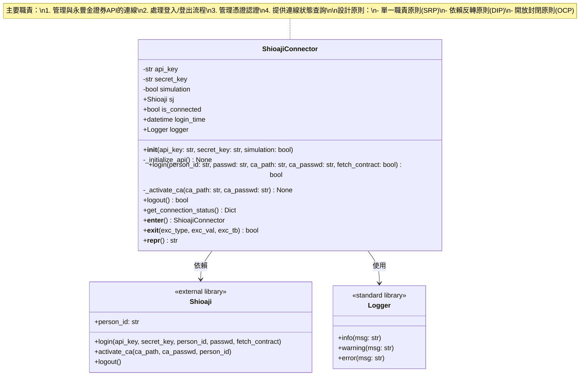
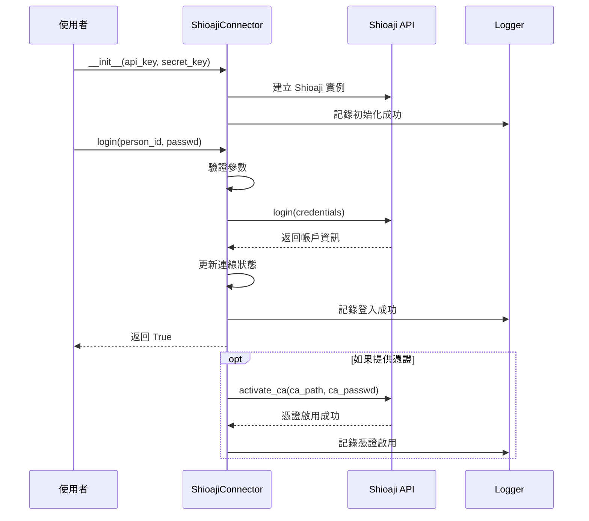
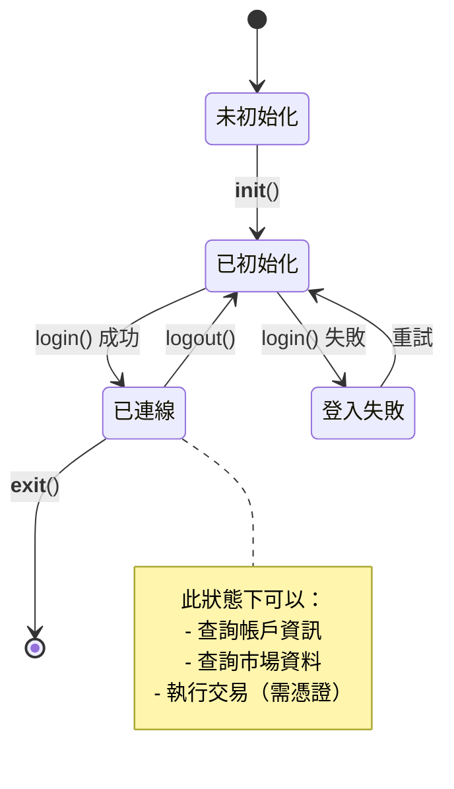
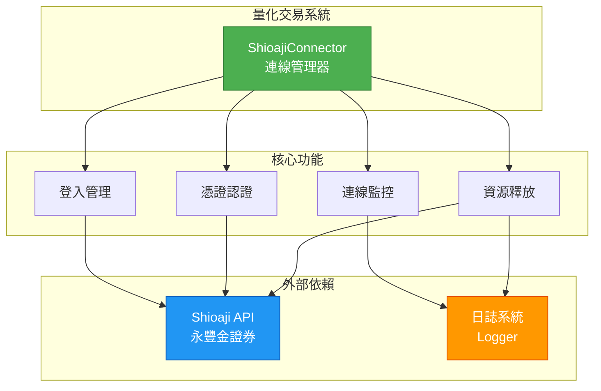

# 量化交易系統 - 類別圖

## Shioaji 連線管理模組類別圖

本文件展示量化交易系統中 Shioaji 連線管理模組的類別結構與關係。

### 主要類別圖

### 類別詳細說明

#### ShioajiConnector (Shioaji 連線器)

**職責：**
- 管理與永豐金證券 Shioaji API 的連線生命週期
- 封裝登入、登出、憑證認證等操作
- 提供連線狀態查詢功能
- 支援 Context Manager 模式 (with 語句)

**設計模式：**
- **Facade Pattern (外觀模式)**：簡化 Shioaji API 的複雜介面
- **Context Manager Pattern**：支援資源自動管理

**SOLID 原則體現：**
1. **單一職責原則 (SRP)**：專注於連線管理，不處理交易邏輯
2. **開放封閉原則 (OCP)**：可透過繼承擴展功能，無需修改原有程式碼
3. **依賴反轉原則 (DIP)**：依賴於 Shioaji 抽象介面，而非具體實作

---

### 時序圖：登入流程

---

### 狀態圖：連線狀態管理

---

### 使用案例圖

---

### 模組便利函數

---

## 設計特點總結

### 1. 符合 SOLID 原則
- ✅ **S (Single Responsibility)**：單一職責，專注連線管理
- ✅ **O (Open/Closed)**：開放擴展，封閉修改
- ✅ **L (Liskov Substitution)**：可被子類別替換
- ✅ **I (Interface Segregation)**：介面精簡，方法職責明確
- ✅ **D (Dependency Inversion)**：依賴抽象而非具體實作

### 2. 良好的錯誤處理
- 所有公開方法都有完整的錯誤處理
- 使用自訂異常提供清晰的錯誤訊息
- 完整的日誌記錄便於問題追蹤

### 3. 完整的文件
- 每個方法都有詳細的 docstring
- 包含參數說明、返回值、異常、使用範例
- 符合 Python 文件規範

### 4. 易用性設計
- 支援 Context Manager (with 語句)
- 提供便利函數 `create_connector`
- 清晰的狀態管理和查詢介面

### 5. 可測試性
- 職責單一，易於單元測試
- 依賴注入設計，便於 Mock
- 清晰的狀態轉換邏輯

---

## 未來擴展方向

---

**文件版本：** 1.0  
**建立日期：** 2025-10-06  
**作者：** Trading System Team  
**最後更新：** 2025-10-06
